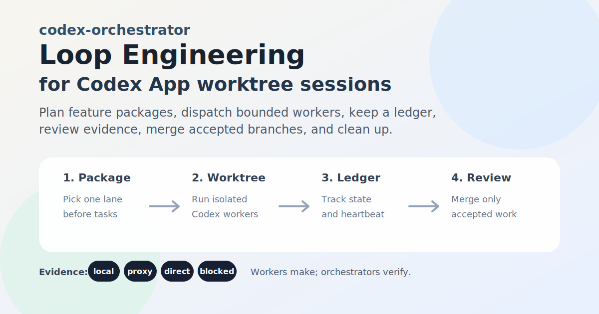
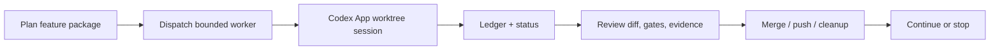

[English](README.md) | [中文](README.zh-CN.md)

# codex-orchestrator

**A Codex App-first engineering harness for Loop Engineering in real
repositories.**

Loop Engineering is the discipline: design the goal, state, feedback, review,
and exit conditions around an agent loop. `codex-orchestrator` is the harness
for that discipline in Codex App: split work into bounded tasks, start isolated
worktree sessions, track state in a local ledger, wake up on a heartbeat,
review completed branches, merge/push accepted work, clean up, and continue
through a roadmap.

The point is not to let agents write forever. The point is to make every worker
branch reviewable, rejectable, mergeable, and cleanable.



## Why It Exists

One Codex chat is enough for small edits. Larger work gets messy:

- worker sessions finish at different times;
- pending worktrees or stuck sessions are easy to miss;
- local checks get described more strongly than the evidence supports;
- completed branches need review, merge, push, and cleanup;
- a long-running loop can drift into random small tasks instead of one feature
  package.

`codex-orchestrator` is the control layer around that workflow: not the loop
idea itself, but the practical harness that keeps the loop observable,
reviewable, and recoverable.

## What "Harness" Means Here

In this project, a harness is not just a bundle of MCP servers, skills, schemas,
or helper commands. Those pieces are useful, but they are only local
capabilities.

The harness is the layer that makes a project's definition of "correct"
executable:

- which source files, docs, and prior decisions count as context;
- which tools and paths a worker may touch;
- what output shape, gates, evidence labels, and review artifacts are required;
- when a task must stop as `blocked` instead of guessing;
- how review feedback becomes a rule, fixture, spec, or status improvement.

If those rules are not written down, an agent will borrow generic defaults from
its training data and produce work that may look polished but not match the
project. `codex-orchestrator` exists to put those project-specific judgments
into the loop.

## When To Use It

Use it when a feature or project needs more than one ordinary Codex chat:

- a large repository with several modules or apps;
- a feature package that can be split into related worktree sessions;
- unattended work where the next morning needs an auditable handoff;
- evidence-sensitive work where `local`, `proxy`, `direct`, and `blocked`
  claims must stay separate;
- branches that should be reviewed, merged, pushed, and cleaned by a supervising
  orchestrator instead of by individual workers.

Do not use the full workflow for a small copy edit, a one-file bug fix, or a
vague "make this better" request. If the work needs live payment/provider,
production, hardware, or owner authorization, codex-orchestrator can prepare and
track the safe parts, but it should stop at the boundary instead of pretending
to have authority.

## What It Includes

- **Codex skill**: installed into `~/.codex/skills/codex-orchestrator`, used by
  Codex App as the orchestration runbook.
- **Optional Go helper CLI**: `codex-orchestrator`, used for ledger, status,
  heartbeat reports, review packs, policy checks, and local update support.
- **Docs and templates**: project maps, package specs, evaluation matrices,
  package plans, orchestration policy, thread maps, concepts/inbox notes,
  pulse/inbox/router prompts, case studies, and routine specs.

The helper now also tracks trust boundaries: it can record developer-agent
misalignment events, snapshot each worker's constraint stack, verify completion
claims against local evidence, draft failure-to-regression fixtures for review,
and surface a `trustRisk` block in status pages.

It is not a daemon, a package-manager-first product, a full agent operating
system, or an unreviewed autonomous coding bot. Codex App still creates and
runs the worker sessions.

## Where It Fits

| Surface | Use |
|---|---|
| **Codex App** | Primary surface. Ask Codex App to read this repo, install/update the skill, and produce a read-only plan first. Only after explicit approval should it create isolated worktree sessions or review/merge/cleanup accepted branches. |
| **Go helper CLI** | Optional local/static support for ledgers, status pages, health checks, review packs, routines, and self-update. It does not create App sessions or replace the orchestrator. |
| **Codex CLI** | Can read the installed skill and run helper commands, but it cannot create Codex App worktree sessions by itself. |
| **Claude Code** | Use the sibling [claude-orchestrator](https://github.com/indiekitai/claude-orchestrator), which adapts the same Loop Engineering idea to Claude Code's terminal-first workflow. |
| **Other reviewers** | Pi, DeepSeek, Claude, or other model reviewers can be attached through review packs as proxy/advisory evidence, not as automatic merge authority. |

## Quick Start

Open Codex App in the repository you want to orchestrate. Copy this prompt as
your first message:

```text
I want to try codex-orchestrator in this repository.

Read https://github.com/indiekitai/codex-orchestrator and use it as a
Codex App-first engineering harness for Loop Engineering.

If the Codex App skill from that repository is not installed, install it into
~/.codex/skills/codex-orchestrator.

If the Go helper CLI is useful for durable ledger state, explain what it does
and then install or build it if safe.

Start with a dry run:
- inspect git status, worktrees, and project docs;
- explain how you would split work into isolated Codex worktree sessions;
- explain what you would monitor, review, merge, push, and clean up;
- label evidence as direct, proxy, local, or blocked.

Do not push, deploy, delete worktrees, or make destructive changes unless I
explicitly approve.
```

Codex should read this repository, install or update the skill if needed, decide
whether the helper is useful, and start with a read-only plan.

## Updating

Updates are user-triggered, not automatic. The recommended path is still
Codex App-first:

```text
Please update my local codex-orchestrator installation from
https://github.com/indiekitai/codex-orchestrator.

Check the installed skill at ~/.codex/skills/codex-orchestrator and the helper
binary on PATH. Fetch or clone the latest repository if needed, update the
Codex App skill, rebuild the Go helper only if it is already installed or
clearly useful, and do not touch any project .codex-orchestrator/ledger.json
files. After updating, run a smoke check and tell me what changed.
```

If you already have the helper installed, you can also run:

```bash
codex-orchestrator self-update
codex-orchestrator self-update --from-github
codex-orchestrator self-update --with-helper
```

`self-update` refreshes the local skill/helper only. It does not dispatch
sessions, mutate project ledgers, merge, push, deploy, or clean worktrees.

## How It Works



The loop is intentionally conservative:

- repo/worktree truth beats chat status;
- workers are makers; the orchestrator and routine reports are checkers;
- shared contracts, migrations, APIs, devices, payments, and deploys are
  serialized;
- `direct`, `proxy`, `local`, and `blocked` evidence stay separate;
- spare concurrency is not a reason to start unrelated work;
- workers commit to their own branches, while the orchestrator reviews and
  merges.

The useful metric is not "how many workers ran." It is accepted change:

- a task needs an objective verifier, such as a test, build, lint, browser/API
  proof, review pack, or explicit blocker;
- state lives outside the chat in the ledger, status page, package plan, and
  review artifacts;
- every package needs a stop condition: accepted, rejected for fixup, blocked,
  drained, or explicitly handed to a human;
- `status` reports an `acceptance` summary so operators can see accepted,
  rejected, abandoned, blocked, reviewable, and in-progress work without
  treating raw task count or `availableSlots` as progress.
- `pack eval` reports `loopControl`, which says whether the loop should
  continue in the same package, stop for acceptance, or block because evidence
  or verifier layers are missing.

## Thread Layout

For long-running Codex App work, one thread is rarely enough. A practical setup
is:

- **Project Orchestrator**: owns repo truth, ledger, worker dispatch, review,
  merge, push, cleanup, and package closeout.
- **Pulse**: wakes on a schedule and reports material changes, missed
  heartbeat gaps, blocked workers, or review-ready commits.
- **Inbox**: collects GitHub issues, user feedback, external reviews, and real
  project-run observations before they become tasks.
- **Router**: reads the thread map and decides which thread should own new
  input. It routes context; it does not implement code or merge branches.
- **Log**: keeps a human-readable journal of decisions and package progress.

`codex-orchestrator init --write-templates` now creates
`.codex-orchestrator/thread-map.md` and
`.codex-orchestrator/pulse-threads.md` so a project can record this topology
instead of relying on chat memory.

For long-lived projects, it also creates a small local knowledge layer:
`.codex-orchestrator/concepts.md` for glossary, stable rules, prior decisions,
and historical pitfalls, plus `.codex-orchestrator/inbox.md` for issues,
feedback, external reviews, and pulse outputs before they become tasks.

## Documentation

- [Full guide](docs/full-guide.md): the original long README with detailed
  workflow, routines, configuration, and examples.
- [v2 helper usage](docs/v2-usage.md): ledger, status, heartbeat, review packs,
  self-update, and CLI details.
- [Router guide](docs/router.md): how to split Project Orchestrator, Pulse,
  Inbox, Router, and Log threads without turning routing into implementation.
- [Routine library](docs/routines/README.md): includes `pr-reviewer`,
  `stale-task-rescuer`, `ci-fixer`, `release-verifier`,
  `docs-drift-checker`, `evidence-label-auditor`,
  `orchestration-policy-auditor`, `roadmap-next-task-suggester`, and
  `budget-policy-report`.
- [Roadmap](docs/roadmap.md): current product direction and completed phases.
- [restaurant POS rewrite case study](docs/case-studies/restaurant-pos-orchestration.md): a
  real project orchestration example.
- [Loop Engineering alignment notes](docs/research/loop-engineering-alignment.md):
  research framing and design tradeoffs.
- [Developer-agent misalignment notes](docs/research/developer-agent-misalignment.md):
  why the tool tracks constraints, self-report claims, and trust risk.
- [Distribution package](docs/distribution-package.md): release assets and
  helper packaging details.

## Related Projects

- [indiekitai/claude-orchestrator](https://github.com/indiekitai/claude-orchestrator):
  a sibling project for Claude Code users. It adapts the same Loop Engineering
  harness idea to Claude Code's terminal-first workflow and Claude-specific
  skill/runtime conventions.

## Name Collision

There are other useful projects named `codex-orchestrator`. This one is the
Codex App-first workflow for supervised worktree-session orchestration. It does
not manage machine fleets, API proxies, credentials, or tmux-based Codex CLI
agents.

## License

MIT
