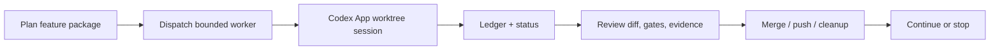

[English](README.md) | [中文](README.zh-CN.md)

# codex-orchestrator

**A Codex App-first orchestration workflow for supervised engineering loops in
real repositories.**

`codex-orchestrator` helps a main Codex App session run a safer outer loop:
split work into bounded tasks, start isolated worktree sessions, track state in
a local ledger, wake up on a heartbeat, review completed branches, merge/push
accepted work, clean up, and continue through a roadmap.

The point is not to let agents write forever. The point is to make every worker
branch reviewable, rejectable, mergeable, and cleanable.

## Why It Exists

One Codex chat is enough for small edits. Larger work gets messy:

- worker sessions finish at different times;
- pending worktrees or stuck sessions are easy to miss;
- local checks get described more strongly than the evidence supports;
- completed branches need review, merge, push, and cleanup;
- a long-running loop can drift into random small tasks instead of one feature
  package.

`codex-orchestrator` is the operating discipline around that workflow.

## What It Includes

- **Codex skill**: installed into `~/.codex/skills/codex-orchestrator`, used by
  Codex App as the orchestration runbook.
- **Optional Go helper CLI**: `codex-orchestrator`, used for ledger, status,
  heartbeat reports, review packs, policy checks, and local update support.
- **Docs and templates**: project maps, package plans, orchestration policy,
  case studies, and routine specs.

It is not a daemon, a package-manager-first product, a full agent operating
system, or an unreviewed autonomous coding bot. Codex App still creates and
runs the worker sessions.

## Quick Start

Open Codex App in the repository you want to orchestrate and paste:

```text
I want to try codex-orchestrator in this repository.

Read https://github.com/indiekitai/codex-orchestrator and use it as a
Codex App-first orchestration workflow.

If the Codex App skill from that repository is not installed, install it into
~/.codex/skills/codex-orchestrator.

If the Go helper CLI is useful for durable ledger state, explain what it does
and then install or build it if safe.

Start with a dry run:
- inspect git status, worktrees, and project docs;
- explain how you would split work into isolated Codex worktree sessions;
- explain what you would monitor, review, merge, push, and clean up;
- label evidence as direct, proxy, local, or blocked.

Do not push, deploy, delete worktrees, or make destructive changes unless I
explicitly approve.
```

Codex should read this repository, install or update the skill if needed, decide
whether the helper is useful, and start with a read-only plan.

## Updating

Updates are user-triggered, not automatic. The recommended path is still
Codex App-first:

```text
Please update my local codex-orchestrator installation from
https://github.com/indiekitai/codex-orchestrator.

Check the installed skill at ~/.codex/skills/codex-orchestrator and the helper
binary on PATH. Fetch or clone the latest repository if needed, update the
Codex App skill, rebuild the Go helper only if it is already installed or
clearly useful, and do not touch any project .codex-orchestrator/ledger.json
files. After updating, run a smoke check and tell me what changed.
```

Command-line users can also run:

```bash
codex-orchestrator self-update
codex-orchestrator self-update --from-github
codex-orchestrator self-update --with-helper
```

`self-update` refreshes the local skill/helper only. It does not dispatch
sessions, mutate project ledgers, merge, push, deploy, or clean worktrees.

## How It Works



The loop is intentionally conservative:

- repo/worktree truth beats chat status;
- shared contracts, migrations, APIs, devices, payments, and deploys are
  serialized;
- `direct`, `proxy`, `local`, and `blocked` evidence stay separate;
- spare concurrency is not a reason to start unrelated work;
- workers commit to their own branches, while the orchestrator reviews and
  merges.

## Documentation

- [Full guide](docs/full-guide.md): the original long README with detailed
  workflow, routines, configuration, and examples.
- [v2 helper usage](docs/v2-usage.md): ledger, status, heartbeat, review packs,
  self-update, and CLI details.
- [Routine library](docs/routines/README.md): includes `pr-reviewer`,
  `stale-task-rescuer`, `ci-fixer`, `release-verifier`,
  `docs-drift-checker`, `evidence-label-auditor`,
  `orchestration-policy-auditor`, `roadmap-next-task-suggester`, and
  `budget-policy-report`.
- [Roadmap](docs/roadmap.md): current product direction and completed phases.
- [restaurant POS rewrite case study](docs/case-studies/restaurant-pos-orchestration.md): a
  real project orchestration example.
- [Loop Engineering alignment notes](docs/research/loop-engineering-alignment.md):
  research framing and design tradeoffs.
- [Distribution package](docs/distribution-package.md): release assets and
  helper packaging details.

## Name Collision

There are other useful projects named `codex-orchestrator`. This one is the
Codex App-first workflow for supervised worktree-session orchestration. It does
not manage machine fleets, API proxies, credentials, or tmux-based Codex CLI
agents.

## License

MIT
