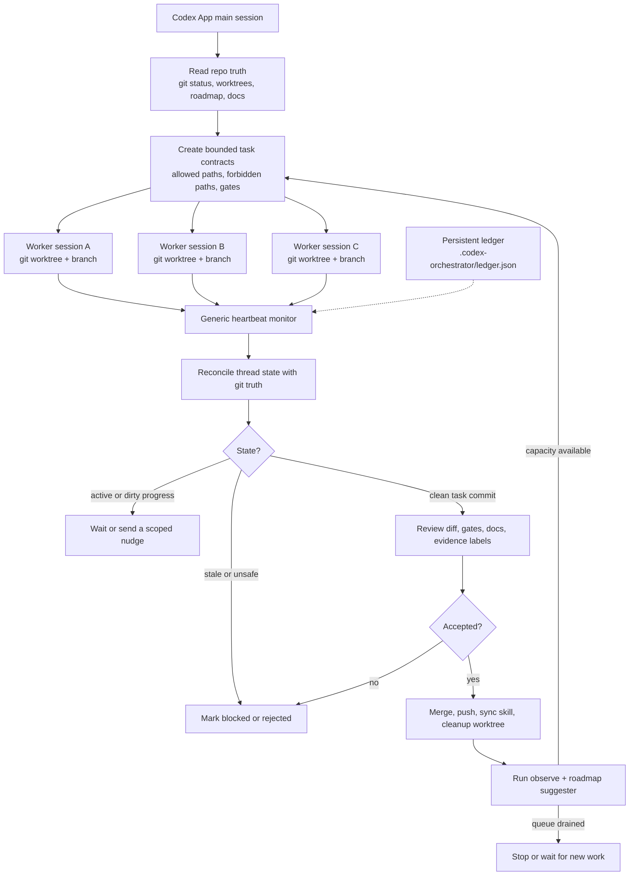

[English](README.md) | [中文](README.zh-CN.md)

# codex-orchestrator

**A Codex App-first orchestration workflow for supervised engineering loops in
real repositories.**

`codex-orchestrator` turns Codex App from one-chat-at-a-time coding help into a
repeatable engineering loop: plan a bounded task, run it in an isolated Codex
worktree session, wake up on a heartbeat, reconcile with git truth, review
before merge, push accepted work, clean the branch, and continue through the
roadmap.

The core idea is simple: a useful agent loop is not "let agents write forever."
It is "make every worker branch reviewable, rejectable, mergeable, and
cleanable."

It is not a daemon, a package-manager-first install, a full agent operating
system, or an unreviewed autonomous coding bot. Codex App still creates and
runs the worker sessions. This repository supplies the skill, prompts, local
ledger helper, routines, and review rules that make those sessions inspectable.

30-second version:

- Codex App stays the place where sessions are created and supervised.
- Each worker gets a small contract: allowed paths, forbidden paths, gates, and
  evidence expectations.
- A local ledger records what was dispatched and what state it reached.
- Heartbeat/status checks compare chat state with actual git/worktree truth.
- Completed branches are reviewed before merge, push, and cleanup.
- Evidence stays honest: `local`, `proxy`, `direct`, and `blocked` are not mixed.

If you are coming from Loop Engineering, maintainer-orchestrator, or
multi-agent discussions, this project focuses on the operational layer that
makes loops usable on real repos:

- clear task contracts with allowed paths, forbidden paths, gates, and proof
  expectations;
- isolated Codex App worktree sessions instead of one sprawling chat;
- durable local ledger and heartbeat reports for status, review pressure, and
  stale-session recovery;
- starter project templates for package planning, orchestration policy, and a
  lightweight project map;
- review/merge/push/cleanup discipline before completed branches are trusted;
- package closeout reports that say whether a feature package is review-ready,
  blocked, still active, or waiting for external review;
- explicit `direct`, `proxy`, `local`, and `blocked` evidence labels, so local
  checks are not overstated as production, device, payment, or runtime proof;
- a continuation guard that checks the broader queue before declaring the loop
  finished.

Best first path: paste the Quick Start prompt below into Codex App from the
repository you want to orchestrate. Let Codex read this repo, install or update
the skill if needed, optionally build the Go helper for ledger support, and
start with a dry run.

Deep dives:
[project story](https://indiekit.ai/blog/2026-06-09-codex-orchestrator-loop-engineering-en),
[TastyFuture case study](docs/case-studies/tastyfuture-orchestration.md), and
[case article](docs/articles/tastyfuture-loop-engineering-case.md).

## 🚀 Quick Start

Open Codex App in the repository you want to orchestrate and paste:

```text
I want to try codex-orchestrator in this repository.

Read https://github.com/indiekitai/codex-orchestrator and use it as a
Codex App-first orchestration workflow.

If the Codex App skill from that repository is not installed, install it into
~/.codex/skills/codex-orchestrator.

If the Go helper CLI is useful for durable ledger state, explain what it does
and then install or build it if safe.

Start with a dry run:
- inspect git status, worktrees, and project docs;
- explain how you would split work into isolated Codex worktree sessions;
- explain what you would monitor, review, merge, push, and clean up;
- label evidence as direct, proxy, local, or blocked.

Do not push, deploy, delete worktrees, or make destructive changes unless I
explicitly approve.
```

Codex should read this repository, install the Codex App skill if it is missing,
decide whether the helper is useful for the current project, and produce a
dry-run orchestration plan before doing mutating work.

When durable state is useful, Codex can use the `codex-orchestrator` helper
binary for a local ledger, `observe`, heartbeat reports, and routine checks.
Users do not install this through Homebrew, npm, or another package-manager
route. The product route is: give the GitHub repository to Codex App, then let
Codex install/read/use the skill and helper only if needed.

If you are evaluating the workflow for the first time, use this order:

1. Paste the prompt into Codex App from the repository you want to orchestrate.
2. Let Codex read this GitHub repository and install or update the skill if needed.
3. Ask for a read-only dry run, and do not create workers or sessions yet.
4. Wait for explicit user approval after the dry-run plan before any merge,
   push, cleanup, or worker creation.
5. Treat the Go helper as optional support for ledger state, heartbeat reports,
   and routines, not something you must learn before the trial.
6. If you want a real-project example first, read
   [docs/case-studies/tastyfuture-orchestration.md](docs/case-studies/tastyfuture-orchestration.md).
7. When the project is ready for durable state, Codex can run
   `codex-orchestrator init --write-templates` to create starter local files
   for the project map, package plan, and orchestration policy.

Naming note: **codex-orchestrator** is the product name, repository name,
Codex App skill name, and helper CLI name.

## Positioning

| You may know | This project focuses on |
|--------------|-------------------------|
| **Codex App** | Human-supervised worktree sessions and App-native delegation |
| **OpenAI Symphony** | Issue-tracker-backed always-on orchestration; `codex-orchestrator` is lighter and App-first |
| **Claude Code `/loop`** | Time-based loop behavior; `codex-orchestrator` adds repo ledger, review, merge, cleanup, and evidence discipline |
| **Generic multi-agent frameworks** | Narrow engineering workflow: bounded tasks, git worktrees, review gates, and honest proof labels |

The goal is not to own the whole agent runtime. The goal is to make Codex App
orchestration repeatable, inspectable, and safe enough for real project work.

## Which Codex Orchestrator Is This?

There are other useful projects with similar names. This one is intentionally
narrower and App-first:

- [`christianreiss/codex-orchestrator`](https://github.com/christianreiss/codex-orchestrator)
  is a self-hosted fleet/auth/config dashboard for Codex and Claude across
  machines. It is about credentials, wrappers, admin UI, compatible APIs, and
  host management. This project does **not** manage your auth, tokens, API
  proxy, or machine fleet.
- [`kingbootoshi/codex-orchestrator`](https://github.com/kingbootoshi/codex-orchestrator)
  is a Claude Code plugin and CLI that launches Codex CLI agents in `tmux`
  sessions. It is about spawning and talking to background CLI agents. This
  project does **not** require `tmux`, Bun, or Claude Code, and it does not
  launch Codex CLI jobs directly.
- `indiekitai/codex-orchestrator` is for Codex App users who want a supervised
  engineering loop around App-created worktree sessions: task contracts,
  heartbeat checks, persistent ledger state, review routines, evidence labels,
  merge/push discipline, and cleanup.

Use this project if you want Codex App to keep moving through a roadmap without
turning every worker chat into an unreviewed branch. Use one of the other
approaches if your main problem is cross-machine auth sync, a web admin
dashboard, or tmux-based CLI agent spawning.

## 🔥 The Problem

Running one Codex session at a time is fine for small tasks. But for anything larger — a new API with 4 endpoints, a module rewrite, a multi-service feature — you hit real pain:

- **Context switching**: Manually checking "is session 3 done yet?" while session 1 needs a merge
- **Stuck sessions**: A session hangs at 80% complete. You don't notice for an hour
- **Merge conflicts**: Two sessions edit the same proto file. Both finish. Neither merges cleanly
- **Overnight babysitting**: You want to dispatch 3 tasks before bed but can't trust them unsupervised

## 🏗️ How It Works

At a glance, `codex-orchestrator` is the supervisory loop around Codex
App-created worker sessions:



## ✨ Key Features

| Feature | What it does |
|---------|-------------|
| **Bounded task contracts** | Each session gets a precise scope: allowed paths, forbidden paths, base commit, acceptance gates, evidence labels |
| **Automatic concurrency control** | Default 2 sessions, up to 3 when write sets are disjoint. Serializes shared contracts (protos, migrations, APIs) |
| **Configurable heartbeat** | Periodic check reconciles thread status with actual git state — no silent overnight stalls; the interval is project-specific |
| **Stuck session recovery** | If a session is idle >15 min: has a clean commit → review and merge directly; has uncommitted useful changes → send a targeted nudge to continue; no useful diff → mark abandoned |
| **Anti-shallow-slice gate** | Rejects "another placeholder page" tasks. Forces vertical completion, runtime proof, or blocker removal |
| **Evidence discipline** | Labels proof as `direct`, `proxy`, `local`, or `blocked`. No upgrading unit tests into production proof |
| **Self-review enforcement** | Every session must review its own diff before handoff. The orchestrator re-reviews before merging |
| **Feature-package planning** | When a domain has multiple partial closures, promotes work to a coherent milestone instead of more tiny slices |
| **Package continuity for unattended runs** | Keeps overnight/continuous dispatch focused on one product module instead of filling slots with unrelated safe backlog items |
| **Package closeout status** | `pack status` combines package summary and acceptance inputs so the orchestrator can tell whether a package is ready, blocked, still active, or waiting for external review |
| **Legacy ledger noise control** | Old cleaned/merged ungrouped tasks stay auditable in JSON but no longer make the current status page look scattered |
| **Continuous operation** | Doesn't stop after one feature — reads roadmap, picks the next buildable feature, dispatches, repeats. Designed for overnight/unattended multi-feature runs |
| **Continuation guard** | A task-specific heartbeat can stop only after the orchestrator checks whether the broader queue should continue |

## ✅ Prerequisites And Safety

This repository is a Codex skill/runbook, not a standalone background daemon.
The fully autonomous loop depends on the host environment exposing compatible
capabilities, especially:

- creating or continuing isolated Codex sessions,
- creating separate git worktrees or equivalent isolated worker environments,
- checking thread status and worktree git state,
- creating/updating recurring automations or heartbeat reminders,
- merging and pushing through normal project git policy.

If those tools are unavailable, the skill should degrade into a manual
orchestration checklist: dispatch fewer sessions, inspect git state directly,
and stop before pretending that monitoring, merge, push, or cleanup happened.

For open-source use, start with a dry run on a disposable repository or feature
branch. Keep automatic push disabled until you trust the review gates and your
project's branch protection policy.

The core skill does not require Python. The v2 helper is a Go CLI that can be
built as a single binary. The Python helper remains as a prototype and
compatibility reference.

## 🚫 What This Is Not

This is not a replacement for engineering judgment, code review, or production
verification. It is a way to make AI-assisted development more structured:
bounded tasks, isolated worktrees, explicit evidence labels, and review before
merge.

The goal is not to let agents write unattended forever. The goal is to keep the
human in the loop at the right leverage point: designing the loop, reviewing the
evidence, and deciding what should ship.

It is also not trying to be a full agent operating system. That route is out of
scope for this project. The practical target is narrower: a reliable harness
around Codex App sessions, with durable state, recovery rules, verification
routines, policy/eval checks, and honest evidence labels.

## 🚀 Codex App Setup Flow

If you want Codex App to do the setup for you, use the bootstrap prompt above.
Codex should inspect this repository and then perform the relevant steps:

```bash
# Install the Codex App skill when needed.
cp -r codex-orchestrator ~/.codex/skills/codex-orchestrator

# Optionally install the helper when durable state is useful.
scripts/install.sh
codex-orchestrator init --write-templates
```

You can also download a prebuilt `codex-orchestrator_<os>_<arch>` binary from
the Releases page and put it on your `PATH`, but that is an advanced/helper
path, not a package-manager distribution channel. Most users should start by
asking Codex App to read this repository.

The intended setup order stays the same even when the helper is used:

1. Give Codex App the GitHub repository.
2. Let Codex read `README.md`, `SKILL.md`, and the setup docs.
3. Let Codex decide whether skill install or helper build is useful.
4. Require a read-only dry run and wait for explicit user approval before any
   worker creation or mutating orchestration step.

For release assets and shell completions, see
[docs/distribution-package.md](docs/distribution-package.md).

## Updating

The update story is also Codex App-first. First install and later updates should
feel the same to the user: give Codex App the GitHub repository and let it
refresh the installed skill/helper.

If you are not sure whether your installed skill or helper is current, paste
this into Codex App:

```text
Please update my local codex-orchestrator installation from
https://github.com/indiekitai/codex-orchestrator.

Check the installed skill at ~/.codex/skills/codex-orchestrator and the helper
binary on PATH. Fetch or clone the latest repository if needed, update the
Codex App skill, rebuild the Go helper only if it is already installed or
clearly useful, and do not touch any project .codex-orchestrator/ledger.json
files. After updating, run a smoke check and tell me what changed.
```

If you prefer the command line from a cloned checkout:

```bash
# Sync the local Codex App skill. Rebuild the helper only if it already exists.
codex-orchestrator self-update

# Force a helper rebuild too.
codex-orchestrator self-update --with-helper

# Only update the skill, leaving any helper binary unchanged.
codex-orchestrator self-update --skill-only
```

`codex-orchestrator self-update` uses `scripts/update-local.sh` under the hood.
It does not dispatch sessions, mutate project ledgers, merge, push, or clean
worktrees. It only refreshes the local skill directory and, when requested or
already installed, rebuilds the helper.

If you are not inside a checkout, the helper can fetch this repository into a
local cache first:

```bash
codex-orchestrator self-update --from-github
```

That command may run `git clone`/`git fetch` only inside its update cache; it
still does not mutate the project you are orchestrating.

After setup, ask Codex App to use codex-orchestrator. Codex may invoke the
installed skill when appropriate:

```
Use codex-orchestrator to split this feature into bounded worktree sessions,
review/merge completed branches, and dispatch the next batch.
```

Or be specific:

```
I need to build a REST API with user auth, CRUD endpoints,
pagination, and rate limiting. Use codex-orchestrator to run this as parallel
sessions overnight.
```

The orchestrator will:
1. Decompose the work into bounded task contracts
2. Dispatch sessions into separate worktrees
3. Run a configurable heartbeat loop
4. Review and merge completed sessions
5. Rescue stuck sessions by harvesting their commits
6. Dispatch the next batch when slots open up

With the v2 helper installed, it can also persist task state in
`.codex-orchestrator/ledger.json` and write heartbeat reports that a fresh
orchestrator session can resume from.

If this is your first trial, ask Codex App to follow the safer
disposable-repository path in
[docs/beta-usability-package.md](docs/beta-usability-package.md) before running
the workflow on a real project.

## 📋 Real Example

**Goal**: Build a REST API with 4 major components.

The orchestrator decomposes it into parallel sessions:

```
Session A: codex/api-auth
  Allowed: src/auth/**, src/middleware/auth.ts, tests/auth/**
  Forbidden: src/db/migrations/**, src/api/products/**
  Gate: npm test -- --grep auth

Session B: codex/api-products
  Allowed: src/api/products/**, src/models/product.ts, tests/products/**
  Forbidden: src/auth/**, src/db/migrations/**
  Gate: npm test -- --grep products
```

Sessions A and B run in parallel (disjoint write sets). After both merge, the orchestrator dispatches:

```
Session C: codex/api-pagination
  Allowed: src/middleware/pagination.ts, src/api/**/router.ts, tests/pagination/**
  Gate: npm test -- --grep pagination

Session D: codex/api-rate-limit
  Allowed: src/middleware/rateLimit.ts, src/config/limits.ts, tests/rateLimit/**
  Gate: npm test -- --grep rateLimit
```

Overnight, the heartbeat catches Session C stuck at minute 22 with a clean commit. The orchestrator reviews the commit directly, merges it, and moves on — no human intervention needed.

## 🪜 Loop Engineering Maturity Model

`codex-orchestrator` is a practical **Codex App-first harness**, not the final
form of agentic software development. It sits between manual prompting and a
future persistent agent runtime.

Worker sessions still own the inner edit/test/fix loop. This project manages
the outer engineering loop around them: task selection, isolation, monitoring,
review, merge, cleanup, and continuation.

| Level | Shape | What changes |
|-------|-------|--------------|
| **v0: Prompting** | Human prompts one agent at a time | The human is the scheduler, reviewer, and recovery loop |
| **v1: Supervised orchestrator skill** | `codex-orchestrator` today | Worktree isolation, bounded task contracts, heartbeat monitoring, review/merge discipline, evidence labels |
| **v2: Persistent task ledger** | A real state store behind the loop | Tasks, attempts, worker state, gates, blockers, and outcomes survive across threads and restarts |
| **v2.5: Verification routine foundation** | Routine contracts become inspectable | Shared output schema, evidence labels, harness map, and validator for reusable routines |
| **v3: Routine library** | Reusable background routines | PR reviewer, CI fixer, stale-session rescuer, rebase helper, docs drift checker, release verifier |
| **v4: Eval and safety layer** | Failures become tests and policies | Orchestration policy auditor, prompt-injection cases, dangerous-operation classifiers, permission checks, evidence-quality evals |

This repository intentionally starts at v1 because that is the layer most teams
can adopt today without running a custom daemon or changing their whole
development platform. The next hard problems are recovery classification,
runtime verification, policy/eval coverage, and reviewable rule improvement.

An agent operating system is deliberately not on this roadmap. The project
should stay focused on making Codex App orchestration more observable,
recoverable, and reviewable.

The ambition is not to claim that a Codex skill is already a complete Loop
Engineering runtime. The ambition is to make the first useful outer loop
concrete: bounded work, isolated execution, heartbeat inspection, honest proof
labels, and review before merge.

See [docs/v2-persistent-ledger-and-heartbeat.md](docs/v2-persistent-ledger-and-heartbeat.md)
for the v2 durable ledger and heartbeat helper design, and
[docs/v2-usage.md](docs/v2-usage.md) for the Codex App + Go helper workflow.
See [docs/routines/README.md](docs/routines/README.md) for the v2.5 routine
contract format and [docs/routines/harness-map.md](docs/routines/harness-map.md)
for the feedback-loop harness model.
For a first-time external-user path from install to a safe local demo, see
[docs/beta-usability-package.md](docs/beta-usability-package.md). For release
copy, see [docs/beta-release-notes-draft.md](docs/beta-release-notes-draft.md).
For a research note on how this maps to Loop Engineering, see
[docs/research/loop-engineering-alignment.md](docs/research/loop-engineering-alignment.md).
For the harness reading notes that de-scope the agent-OS route, see
[docs/research/harness-reading-notes.md](docs/research/harness-reading-notes.md).
For this repository's own project map example, see
[docs/CODEBASE_MAP.md](docs/CODEBASE_MAP.md).
For the broader roadmap, see [docs/roadmap.md](docs/roadmap.md).

The v2 helper CLI currently supports:

```bash
go build -o codex-orchestrator ./cmd/codex-orchestrator
./codex-orchestrator init
./codex-orchestrator dispatch record --task-id TASK --package-id PACKAGE --pending-worktree-id PENDING_ID --branch codex/task --gate "go test ./..."
./codex-orchestrator dispatch reconcile --task-id TASK
./codex-orchestrator run-mode set --dispatch-mode drain --note "finish current batch only"
./codex-orchestrator record-task --id TASK --package-id PACKAGE --worktree /path/to/wt --branch codex/task --max-runtime-minutes 90 --review-budget-minutes 25
./codex-orchestrator observe
./codex-orchestrator heartbeat --count 1 --write-report .codex-orchestrator/heartbeat-report.json
./codex-orchestrator status
./codex-orchestrator preflight --repo . --write-summary .codex-orchestrator/preflight.md
./codex-orchestrator status --html > /tmp/codex-orchestrator-status.html
./codex-orchestrator status --write-html .codex-orchestrator/status.html --write-summary .codex-orchestrator/status.md
./codex-orchestrator watchdog status --repo .
./codex-orchestrator pack merge-readiness --task-id TASK --write-report /tmp/merge-readiness-pack.json
./codex-orchestrator pack consultation --task-id TASK --write-report /tmp/consultation-request-pack.json
./codex-orchestrator pack review --package-id PKG --output /tmp/review-pack/PKG
./codex-orchestrator pack acceptance --package-id PKG --write-report /tmp/package-acceptance.json
./codex-orchestrator review policy check --package-id PKG --risk medium --task-count 4 --json
./codex-orchestrator review run --package-id PKG --reviewer pi --pack /tmp/review-pack/PKG --write-report /tmp/pi-review-run.json
./codex-orchestrator review import --package-id PKG --reviewer deepseek --file /tmp/deepseek-review.md --status passed
./codex-orchestrator append-event --type review --task-id TASK --status completed-unreviewed
./codex-orchestrator validate-routines --dir routines
./codex-orchestrator run-routine pr-reviewer --task-id TASK --write-report /tmp/pr-reviewer-report.json
./codex-orchestrator run-routine stale-task-rescuer --task-id TASK --write-report /tmp/stale-task-rescuer-report.json
./codex-orchestrator run-routine ci-fixer --task-id TASK --write-report /tmp/ci-fixer-report.json
./codex-orchestrator run-routine release-verifier --tag v0.3.0-alpha.1 --write-report /tmp/release-verifier-report.json
./codex-orchestrator run-routine docs-drift-checker --write-report /tmp/docs-drift-checker-report.json
./codex-orchestrator run-routine evidence-label-auditor --write-report /tmp/evidence-label-auditor-report.json
./codex-orchestrator run-routine orchestration-policy-auditor --write-report /tmp/orchestration-policy-auditor-report.json
./codex-orchestrator run-routine roadmap-next-task-suggester --write-report /tmp/roadmap-next-task-suggester-report.json
./codex-orchestrator run-routine budget-policy-report --write-report /tmp/budget-policy-report.json
./codex-orchestrator policy check --write-report /tmp/policy-check-report.json
./codex-orchestrator eval run --write-report /tmp/eval-run-report.json
./codex-orchestrator eval add-failure --id dry-run-example --text "Dry run mode can dispatch workers immediately." --expect OPA001=1
./codex-orchestrator rules propose --from-review docs/reviews/example.md --write-report /tmp/rules-proposal-report.json
./codex-orchestrator record-routine-run --routine pr-reviewer --status passed --evidence-local "go test ./..." --action "reviewed diff" --next "merge branch"
./codex-orchestrator record-routine-run --report-json examples/routine-reports/pr-reviewer.passed.json
```

The JSON heartbeat report includes `overallStatus`, per-status `counts`, a
`reviewPressure` block, read-only `budgetSummary`, and additive
`budgetPressure` warnings. It also includes a `jobSummary` block inspired by
jobs/status dashboards: total tasks, per-status counts, and compact rows for
each tracked task. Related tasks can be grouped with `--package-id`; `observe`,
`status`, and heartbeat summaries then expose a `packageSummary` with
package-level active/review/blocked/cleanup state, completion progress, external
review status, and the next suggested package action. This is the project
dashboard layer: a human can see which product lane is active, how many workers
are already closed, what is waiting for review, and why the next action still
belongs to the same package. `packageSummary` also applies the local/static
review policy: when a package has enough workers or matches higher-risk
keywords such as contract, DB, auth/security, payment, provider, hardware, or
pre/prod work, the status output marks whether an external package review is
required and what review pack/import action is next. `observe`, `status`, and
heartbeat summaries also expose a `packageLaneGuard` block that warns when
workers are ungrouped, multiple package lanes are active, or an available slot
should only be filled with work from the current lane. Reports also include a
`dispatchRecommendation` block with `recommended`, `reason`, `nextAction`, and
`availableSlots`; treat this as the action signal and treat raw slots as
capacity only. If one package worker is active or pending, `recommended=false`
keeps the orchestrator from filling the free slot with unrelated safe work.
The compact `timeline` shows the recent task/routine sequence without reading
raw ledger events. `observe`, `status`, and heartbeat summaries also expose a read-only
`projectMap` signal. The helper checks for common project-map files such as
`docs/CODEBASE_MAP.md`; when none exists, it asks Codex App to generate or read
a concise map before first orchestration.

Per-task runtime/review budgets recorded with `record-task` are surfaced in
`observe`, `status`, and heartbeat summaries for visibility only. Runtime
pressure is computed from local ledger timestamps; review pressure is computed
only when a review-ready timestamp is recorded. Missing or indeterminate budget
data is labeled as local/static helper evidence. The helper does not kill
processes, schedule sessions, or enforce budgets.

`status --html` writes a local/static HTML status page to stdout. It starts with
a human-readable `当前进度` panel that summarizes current status, the active
feature package, recently completed work, running or waiting work, required
human action, next step, and risk/evidence boundaries before listing detailed
task tables. The package section now renders product-lane cards with progress,
review status, member task queues, package-specific next actions, and review
policy requirements. Status pages also show a `Preflight` block, a `Lane Guard`
block, and a short `Timeline` block before the raw job tables, so a human can
answer "can I walk away?", "are we still in one product module?", and "what
just happened?" from the same page. It
intentionally keeps dispatch-slot and raw ledger jargon below the first screen.
When `run-mode` is `drain` or `paused`, the status page labels dispatch slots
as non-dispatchable even if raw capacity is available, so the page does not
encourage unrelated filler workers. It also treats untracked
`.codex-orchestrator/` files as local orchestration state rather than business
code dirtiness.
It is meant for a quick human scan without reading raw JSON.
It does not start a server, daemon, scheduler, merge, push, cleanup, or runtime
monitor.
`status --write-html .codex-orchestrator/status.html --write-summary
.codex-orchestrator/status.md` is the recommended per-cycle snapshot for a
Codex App orchestrator: refresh it during every monitor/review/dispatch turn and
include the paths in the user-facing status update so humans do not need to run
helper commands manually.

Hands-off runs are not only overnight. Use the same readiness checks whenever a
human starts work and walks away for lunch, meetings, errands, or the end of the
day: verify the machine is unlikely to sleep or record that as a blocked
reliability risk, verify the generic Codex App heartbeat automation is bound to
the right thread/repo/ledger, keep dynamic worker state in the ledger/status
files instead of the automation prompt, and run the helper heartbeat with
missed-run detection on every wakeup:

```bash
./codex-orchestrator preflight --repo . \
  --write-summary .codex-orchestrator/preflight.md \
  --write-report .codex-orchestrator/preflight.json

./codex-orchestrator heartbeat --count 1 --interval 20m --missed-after 45m \
  --write-report .codex-orchestrator/heartbeat-report.json \
  --write-summary .codex-orchestrator/heartbeat-summary.md
```

`preflight` is the one-shot "can I leave this running?" check. It inspects
repo cleanliness, ledger shape, dispatch mode, last heartbeat gap, macOS
watchdog status, project map presence, package-lane health, and missing
external review evidence. It is local/static only; warnings should be surfaced
before leaving the orchestrator unattended, but they do not prove Codex App,
OS, or runtime behavior. By default warnings print and exit successfully so the
command can be used for status snapshots; add `--fail-on-warning` when using it
as a shell gate. Defaults are `--interval 20m` and `--missed-after 45m`.

If a missed heartbeat is reported, surface it before continuing normal
review/dispatch work. This is local/static evidence only: it can show that
scheduled checks were missed, but it cannot prove whether the cause was Codex
App automation delivery, machine sleep, OS power state, or thread scheduling.
For long hands-off runs where this matters, use an external OS-level watchdog or
notification in addition to Codex App heartbeat.

On macOS, install a user LaunchAgent watchdog for a project checkout:

```bash
REPO=/path/to/project ./scripts/install-macos-watchdog.sh
```

Check the installed watchdog and its last local/static report:

```bash
codex-orchestrator watchdog status --repo /path/to/project
```

The LaunchAgent runs `scripts/macos-watchdog-run.sh` every 20 minutes by
default. It writes `.codex-orchestrator/watchdog-heartbeat-report.json` and
`.codex-orchestrator/watchdog-heartbeat-summary.md`; if the helper reports
`heartbeatStatus.status=missed`, it sends a macOS notification. This is an
external warning layer only: it still does not create Codex sessions, dispatch
workers, review, merge, push, cleanup, or keep a sleeping Mac awake.

`dispatch record` and `dispatch reconcile` are the App-first dispatch closure
commands. Use `dispatch record` immediately after Codex App returns a
`pendingWorktreeId`, along with the task ID, package ID, optional thread ID,
expected branch, base commit, allowed/forbidden paths, and gates. Use
`dispatch reconcile` after
local `git worktree list` truth contains the worker branch or worktree. Both
commands label their output as `local/static`: a pending worktree ID is setup
evidence only, and a resolved worktree is not proof that the task is correct.
If setup fails, record a blocked setup event immediately; a failed
`pendingWorktreeId` should not keep showing as pending setup.
`fatal: invalid reference` during setup is an immediate setup failure, not a
queued worker; it usually means the desired new branch was passed as an
existing starting reference.

Git path inspection uses `core.quotePath=false` internally so non-ASCII paths
such as Chinese review files are compared as human-readable paths instead of
escaped octal strings. This reduces false allowed/forbidden path findings in
merge-readiness and package acceptance checks.

`run-mode set --dispatch-mode active|drain|paused` records run-level dispatch
intent in the ledger. Use `drain` when the orchestrator should finish current
workers but stop filling empty slots, and `paused` when unattended dispatch is
stopped until explicitly resumed. This is local/static state only: it does not
stop workers, create or delete automations, merge, push, or cleanup by itself;
it makes `observe` and `status` avoid recommending new dispatch while drained
or paused.

`pack merge-readiness` converts a completed-unreviewed ledger task into a
standard local/static review package. The JSON report includes task metadata,
git status, commit count after `baseCommit`, `git diff --name-status`,
allowed/forbidden path checks from the ledger write set, `git diff --check`,
review doc/artifact/self-review/evidence-label/docs-drift signals, recorded and
suggested gates, residual risks, and `needsHuman` when evidence is missing. It
also emits an `authorizationMatrix`, a `liveProofGate`, and an
`acceptanceReport` draft so the orchestrator can separate "review evidence
exists" from "merge/push/cleanup/release is authorized." It does not merge,
push, cleanup, dispatch, edit git state, or claim runtime, production, device,
or direct worker proof.

`pack acceptance --package-id PKG` aggregates the selected package workers into
a package-level local/static acceptance report. If no `--task-id` is provided,
it selects tasks recorded with that `packageId`. The report combines each
task's merge-readiness acceptance draft with imported external reviewer runs
for the same package, then emits one decision such as `review-ready`,
`needs-review`, `reject-for-fixup`, or `blocked`. It is an acceptance artifact,
not a merge command: merge, push, cleanup, release, deploy, and direct proof
still require a separate orchestrator closeout decision.

`pack review --package-id PKG` now also defaults to the tasks recorded with that
package when explicit `--task-id` flags are omitted. Use it at a feature-package
boundary to create a portable handoff for Pi, Claude, DeepSeek, a human reviewer,
or another read-only model. External reviewer output remains `proxy/advisory`
evidence and should be compared with the package acceptance report before the
orchestrator accepts or blocks the package.

`pack consultation` converts a blocked, stale, decision-gated, or human-action
ledger task into a concise local/static consultation request. The JSON report
includes task metadata, observed local status, inferred blocker, attempted
paths from task history and routine runs, recorded gates, evidence labels,
required human input or physical action, decision options with tradeoffs, the
next safe action, and whether to keep or clean the task branch/worktree. It does
now also includes an `ownerDecisionBrief`, an `authorizationMatrix`, and a
`liveProofGate`, borrowing the useful maintainer-orchestrator discipline that a
human request should be decision-ready rather than a bare URL or vague blocker.
It does not dispatch, merge, push, cleanup, mutate the ledger, edit git state,
call the network, or claim runtime, product, device, or direct proof; the actual
decision or human action remains `blocked` outside the pack.

`pack review` is the package-level external-review handoff. Use it after several
related slices form a feature package, not for every small worker. It combines
task contracts, diffs, changed files, gates, evidence labels, residual risks,
authorization boundaries, and a reviewer prompt into a portable local/static
directory. `review policy check` reads `.codex-orchestrator/review-policy.json`
when present, otherwise uses built-in defaults, and recommends whether zero,
one, or two reviewers are needed for a package risk level. `review run` can
invoke a local `pi` or `claude -p` reviewer in read-only mode; `claude
ultrareview` is intentionally not part of this default workflow. `review import`
records manually gathered DeepSeek, Claude, Pi, or human findings back into the
ledger. All external-review output is
`proxy/advisory` evidence: it can block or inform acceptance, but it never
authorizes implementation, merge, push, cleanup, release, deploy, or direct
runtime/device/provider proof by itself. For the design rationale, see
[docs/research/package-review-policy.md](docs/research/package-review-policy.md).

Codex App worktree dispatch is App-first. Save the repository as a Codex App
project before relying on project worktree sessions. If dispatch fails because
the project is unknown, or setup never resolves to a real worktree/thread,
treat it as a setup blocker. Do not let a fallback worker edit the
orchestrator's own checkout; first create and verify an isolated fallback
worktree, or stop and report the blocker.

`run-routine pr-reviewer` is the first runnable routine MVP. It is read-only
against the task worktree: it loads the ledger task, checks worktree and branch
state, records `git status --short --branch`, compares `baseCommit..HEAD`,
captures `git diff --name-status`, and runs `git diff --check`. It writes a
standard `RoutineRunReport` JSON that can later be recorded with
`record-routine-run --report-json`. It does not merge, push, delete branches,
clean worktrees, run task-specific test gates, or claim runtime proof.

`run-routine stale-task-rescuer` is the second runnable routine MVP. It is also
read-only against the task worktree: it loads the ledger task by id, records
ledger status, last observation, and recent task history, verifies worktree and
branch state, captures `git status --short --branch` and `git log --oneline -3`,
then classifies rescue readiness from local git state. A clean task with
commits after `baseCommit` passes with the next action set to orchestrator
review of the committed diff. Useful uncommitted changes fail with evidence and
a same-worker or same-task takeover recommendation. Missing worktrees, branch
mismatches, missing `baseCommit`, or git inspection failures block. The runner
does not modify ledger status, stage, commit, merge, clean worktrees, dispatch
new work, or claim direct/proxy runtime proof; MVP evidence is `local` or
`blocked` only.

`run-routine ci-fixer` is the third runnable routine MVP. Despite the name, it
does not edit code or auto-fix CI. It does execute trusted gate commands already
recorded on the ledger task, so do not run it against an untrusted repository or
untrusted ledger. It loads the ledger task by id, verifies the task worktree and
expected branch, refuses dirty worktrees, compares `baseCommit..HEAD`, records
the committed file list, and runs those recorded gates in the task worktree
with a local timeout. Passing gates plus committed work after `baseCommit`
return `passed` with a next action to run the orchestrator review/merge flow.
Dirty worktrees or failing gates return `failed` and send the task back to the
same worker or a same-task takeover. Missing gates, missing `baseCommit`, branch
mismatches, or git inspection failures return `blocked`. It does not stage,
commit, merge, push, clean worktrees, modify ledger status, or claim
direct/proxy runtime proof; MVP evidence is `local` or `blocked` only.

`run-routine release-verifier` is the fourth runnable routine MVP. It is
read-only and does not load or update the ledger. It verifies a supplied local
git tag, reads GitHub release metadata through `gh release view` when `gh` is
available, checks alpha/beta/rc prerelease flags, and compares release asset
names against this repo's default Go CLI asset set or repeated
`--expected-asset` overrides. Missing tags, missing releases, drafts,
prerelease mismatches, and missing assets return `failed`; unavailable `gh`,
auth/network failures, or unparseable release metadata return `blocked`. It
does not create or edit releases, move tags, upload assets, stage, commit,
merge, push, clean, dispatch, mutate the ledger, or claim production/runtime
proof; MVP evidence is `local`, `proxy`, or `blocked`.

`run-routine docs-drift-checker` is the fifth runnable routine MVP. It is
read-only and does not load or update the ledger. It parses the local
`run-routine` command surface from `cmd/codex-orchestrator/main.go`, compares
the runnable routine IDs with `routines/*.json`, and scans `README.md`,
`README.zh-CN.md`, `SKILL.md`, `docs/routines/README.md`, `docs/v2-usage.md`,
and `docs/roadmap.md` when present for obvious missing routine references or
stale status text. It also scans `docs/reviews/*.md` for accepted or merged
central-impact task notes that mention command/routine/source changes but do
not record a central docs update or explicit docs-drift decision. Missing docs
references, missing specs, or post-merge docs-drift guard warnings return
`failed`; missing repository/source/spec/review-doc access returns `blocked`.
It does not stage, commit, merge, push, tag, release, clean worktrees, dispatch
sessions, mutate the ledger, or claim runtime proof; MVP evidence is `local`
or `blocked`.

`run-routine evidence-label-auditor` is the sixth runnable routine MVP. It is
read-only and does not load or update the ledger. It scans explicit repo-local
docs, review/handoff notes, routine specs, routine report JSON files, and
ledger-shaped JSON for obvious evidence-label issues: weak evidence wording
near strong proof wording, weak evidence promoted to direct/pre/prod/device/
runtime/payment proof without explicit direct evidence wording,
RoutineRunReport JSON missing the `direct` / `proxy` / `local` / `blocked`
buckets, and direct evidence recorded for routines whose specs explicitly
reserve direct evidence. It applies deterministic named policy/eval rules
(`ELA001`-`ELA010`), treats glossary/prohibition/blocked-definition/rule-
description wording as allowed negatives, and reports local rule-hit summaries
when findings are present. Findings are heuristic suspicions, not proof of
wrongdoing. It does not stage, commit, merge, push, tag, release, clean
worktrees, dispatch sessions, mutate the ledger, or claim runtime proof; MVP
evidence is `local` or `blocked`.

`run-routine orchestration-policy-auditor` is the first V4 policy/eval routine
MVP. It is read-only and does not load or update the ledger. It scans
repo-local orchestration docs, prompts, routine specs, routine reports, and
ledger/event files for deterministic orchestration policy rules (`OPA001`-
`OPA009`): dry-run dispatch barrier, no-main-checkout fallback guard, heartbeat
continuation guard, delegated worker boundaries, evidence promotion boundaries,
heartbeat target binding guard, pending worktree ledger guard, budget-policy
evidence/control boundary drift, and unrelated safe-backlog dispatch that breaks
feature-package continuity. The heartbeat lifecycle checks also flag repeated
generic heartbeat prompt updates that should have been ledger/status changes.
Findings are
local/static suspicions, not proof of wrongdoing. It
does not stage, commit, merge, push, tag, release, clean worktrees, dispatch
sessions, mutate the ledger, or claim runtime proof; MVP evidence is `local`
or `blocked`.

`policy check` is the first product-facing V4 policy/eval command. It wraps the
read-only orchestration policy auditor and also runs transcript-backed local
eval fixtures from `eval/orchestration-policy-auditor/`. The initial fixtures
cover the failures this project already encountered in real orchestration:
dry-run dispatch without explicit approval, main-checkout fallback after
worktree setup failure, stopping the larger queue after one child task,
delegated worker prompts missing core boundaries, local/proxy evidence
promotion, heartbeat automation bound to the literal `current` placeholder or
a stale fixed task id, foreground sleep/polling used instead of Codex App
heartbeat wakeups, duplicate heartbeat creation, heartbeat creation without
persisted automation truth verification, pending worktree ids kept only in
prompt/chat state or counted as running before setup is confirmed,
setup-failure cases where the
orchestrator writes delegated worker implementation code itself, and
budget-policy helper control or evidence overclaims. It does not dispatch
Codex sessions, mutate git, update the ledger, or claim runtime proof; the
result is local/static policy evidence. Private transcript parsing is not part
of this MVP; transcript-shaped fixtures are sanitized local/static
reconstructions.

`eval run` runs the policy fixture suite by itself. Use it when changing
policy rules and you want deterministic regression coverage without scanning
the current repository text. The first suite is
`orchestration-policy-auditor`; it reads fixtures from
`eval/orchestration-policy-auditor/` and compares actual `OPAxxx` hit counts
against each fixture's `expectedRuleHits`.

`eval add-failure` adds a manually supplied failure case to the fixture suite.
For the MVP, pass the text and expected rule hits explicitly. The command
verifies the text against the current policy rules before writing JSON, refuses
to overwrite an existing fixture unless `--force` is supplied, and does not
parse review documents automatically yet.

`rules propose` turns local evidence text or a review file into a review-only
rule proposal report. It can read `--from-review`, `--text`, or `--text-file`,
and it writes only the proposal report when `--write-report` is supplied. It
does not edit `SKILL.md`, README files, AGENTS/CLAUDE instructions, policy
files, or project rules; every proposal is marked as needing human review.

`run-routine roadmap-next-task-suggester` is the eighth runnable routine MVP.
It is read-only and does not mutate the ledger. It parses remaining candidate
tasks from `docs/roadmap.md`, compares them against local runnable routine IDs
and `routines/*.json`, optionally filters duplicate active or merged matches
from a repo-local `.codex-orchestrator/ledger.json`, and prefers conservative
read-only local tasks over mutating, release-scoped, or network-dependent
work. If only unsafe items remain, it returns a queue-drained next action
instead of pretending to dispatch. It does not stage, commit, merge, push,
tag, release, clean worktrees, dispatch sessions, mutate the ledger, or claim
runtime proof; MVP evidence is `local` or `blocked`.

`run-routine budget-policy-report` is a read-only local/static budget visibility
runner. It inspects roadmap/routine docs, routine budget metadata, optional
repo-local ledger state, and an optional heartbeat report when present. It
keeps budget metadata and heartbeat `budgetPressure` warnings as `local`
evidence, records unavailable live runtime/review timing as `blocked`, and
does not schedule, prioritize, pause, kill, dispatch, merge, push, delete,
cleanup, mutate the ledger, or enforce budgets.

`roadmap score` is a read-only local/static planning command for project-aware
next-task selection:

```bash
codex-orchestrator roadmap score --repo .
codex-orchestrator roadmap score --repo . --config roadmap-score.json --ledger .codex-orchestrator/ledger.json --json
```

By default it reads explicit project planning surfaces such as
`docs/roadmap.md`, `PROGRESS.md`, and
`docs/TastyFuture-整体开发计划与进度.md` when those files exist. It does not scan
all review docs by default, because review notes often contain risks and
postmortem wording that should not become dispatchable work. A config file may
provide a simple JSON `sources` list when a project wants to include selected
review docs:

```json
{"sources":["PROGRESS.md","docs/roadmap.md","docs/reviews/accepted.md"]}
```

It scores candidate lines as `vertical-completion`, `runtime-proof`,
`blocked-removal`, `owner-gated`, or `shallow-risk`, with local write-set and
external-dependency hints. When a repo-local `.codex-orchestrator/ledger.json`
exists, or `--ledger PATH` is supplied, it reads that ledger read-only and
demotes candidates that match completed/merged/cleaned ledger tasks. Feature
package / package status candidates are ranked ahead of unrelated safe task
fillers so the loop can keep a coherent module lane.
It does not dispatch sessions, mutate git or the ledger, call the network, or
claim direct runtime/product proof; human review still decides whether a scored
candidate is worth dispatching.

When a delegated task is merged, pushed, released, and cleaned, the
task-specific heartbeat is not automatically the end of the loop. Before
deleting that heartbeat, the orchestrator should inspect ledger/repo truth and
the roadmap queue. If safe work remains, it should dispatch the next bounded
task or replace the heartbeat with a next-task monitor. Delete the heartbeat
only after the queue is drained, or after the next action is blocked and
reported.

In an already-authorized continuous loop, an integration branch that is ahead
only because of reviewed orchestrator-owned commits is not a reason to stop and
ask whether to push or continue. Push as part of the normal project closeout
when policy allows it. If push/auth/remote policy blocks the closeout, keep the
heartbeat active and report the blocker instead of deleting the monitor.

When workers are merely active or have scoped dirty progress, the orchestrator
should finish the current turn and let Codex App heartbeat wake the thread
later. It should not use shell `sleep`, foreground polling, or the helper's
`heartbeat` report command as a replacement for App automation. Before creating
a monitor, inspect existing automations and update the existing heartbeat when
one already covers the same thread/repo/queue. After creation, verify persisted
automation truth instead of trusting only the create response.

Once a generic monitor is verified, keep it stable. Do not rewrite the
automation prompt every wakeup with the current task IDs, worker status, or
review queue. Put changing state in `.codex-orchestrator/ledger.json`, review
reports, heartbeat summaries, or the normal turn status. Update the automation
only when schedule, target, repository, or the generic monitor contract
materially changes.

## 🧱 Architecture

The orchestrator operates as a **state machine** over delegated sessions:

```
dispatch → active → completed-unreviewed → merged
                 ↘ stale-needs-inspection → rescued/abandoned
                 ↘ blocked → waiting for human input
```

**Key components:**

- **State Ledger**: Tracks task ID, thread ID, worktree, branch, base commit, write set, status, and gates for every session
- **Heartbeat Loop**: At the configured interval, reconciles Codex thread status with actual git state
- **Review Pipeline**: Diff boundary check, self-review verification, contract conflict detection, evidence label validation
- **Anti-Shallow-Slice Gate**: Classifies every task as `vertical-completion`, `runtime-proof`, `blocked-removal`, or `owner-gated`

## ⚖️ vs Manual Orchestration

| | Manual | codex-orchestrator |
|---|--------|-------------------|
| **Session monitoring** | You check each session tab manually | Configured heartbeat auto-reconciles |
| **Stuck sessions** | You notice (eventually) and intervene | Auto-detected at 15 min, commit harvested |
| **Merge conflicts** | Discovered at merge time | Prevented by disjoint write-set enforcement |
| **Shallow work** | Sessions produce placeholder pages | Anti-shallow-slice gate rejects or rewrites |
| **Evidence honesty** | Trust the session's self-report | `direct`/`proxy`/`local`/`blocked` labels enforced |
| **Overnight runs** | You wake up to a mess | You wake up to merged branches |
| **Concurrency** | YOLO parallelism | Serialized contracts, max 2-3 with rules |

## ⚙️ Configuration

These parameters are tunable in the skill or per-dispatch:

| Parameter | Default | Description |
|-----------|---------|-------------|
| Max concurrency | 2 | Active sessions. Raise to 3 only when write sets are disjoint and no shared contracts are active |
| Stale threshold | 15 min | Time without progress before a session is flagged for inspection |
| Heartbeat interval | Project-specific | How often the orchestrator checks all sessions; examples may use 20 minutes for hands-off runs or tighter intervals for active monitoring |
| Branch prefix | `codex/` | Namespace for task branches |
| Push policy | Project-specific | Push only when normal for the repository or explicitly requested |
| Evidence labels | `direct`, `proxy`, `local`, `blocked` | Required classification for local, hardware, deploy, or payment proof |
| Anti-shallow-slice | Enforced | Tasks must be classified before dispatch |

## 📂 File Structure

```
codex-orchestrator/
├── SKILL.md              # The orchestrator skill (copy to ~/.codex/skills/)
├── agents/
│   └── openai.yaml       # Agent interface definition
├── .github/workflows/
│   └── release.yml       # Cross-platform release binary workflow
├── cmd/
│   └── codex-orchestrator/
│       ├── main.go       # Go helper CLI
│       └── main_test.go  # CLI state-machine tests
├── docs/
│   ├── beta-release-notes-draft.md
│   ├── beta-usability-package.md
│   ├── case-studies/
│   │   └── tastyfuture-orchestration.md
│   ├── distribution-package.md
│   ├── roadmap.md
│   ├── research/
│   │   └── loop-engineering-alignment.md
│   ├── reviews/
│   ├── routines/
│   │   ├── README.md
│   │   └── harness-map.md
│   ├── v2-usage.md
│   └── v2-persistent-ledger-and-heartbeat.md
├── routines/
│   ├── api-proof.json
│   ├── browser-runtime-proof.json
│   ├── ci-fixer.json
│   ├── database-proof.json
│   ├── device-proof.json
│   ├── docs-drift-checker.json
│   ├── evidence-label-auditor.json
│   ├── log-proof.json
│   ├── orchestration-policy-auditor.json
│   ├── pr-reviewer.json
│   ├── release-verifier.json
│   ├── roadmap-next-task-suggester.json
│   ├── budget-policy-report.json
│   └── stale-task-rescuer.json
├── examples/
│   ├── ledger.example.json
│   └── routine-reports/
│       ├── api-proof.blocked.json
│       ├── budget-policy-report.review-only.json
│       └── pr-reviewer.passed.json
├── scripts/
│   ├── build-release-assets.sh
│   ├── install.sh
│   ├── ledger_heartbeat.py
│   ├── install-macos-watchdog.sh
│   ├── macos-watchdog-run.sh
│   ├── update-local.sh
│   └── publish-release.sh
├── go.mod
├── README.md             # This file
├── README.zh-CN.md       # Chinese README
└── LICENSE               # MIT
```

## 📄 License

MIT

---

Built by [IndieKit.ai](https://indiekit.ai) — open-source developer tools for the AI-native workflow.
