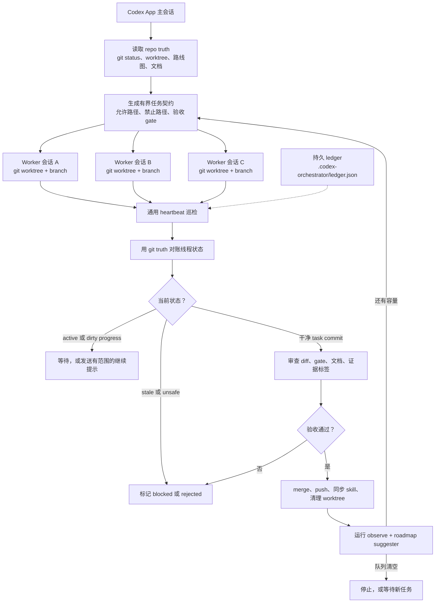

[English](README.md) | [中文](README.zh-CN.md)

# codex-orchestrator

**给真实代码仓库用的 Codex App-first 受监督工程循环。**

`codex-orchestrator` 把 Codex App 从“一次开一个聊天写代码”，推进到一个可重复的
工程循环：规划有界任务，在隔离的 Codex worktree session 里执行，用 heartbeat
唤醒检查，用 git truth 对账，先审查再合并，push 已接受的工作，清理分支，然后继续
推进路线图。

核心想法很简单：有用的 Agent loop 不是“让 Agent 一直自动写下去”，而是让每一个
worker branch 都可审查、可拒绝、可合并、可清理。

它不是 daemon，不是以 Homebrew/npm 这类 package manager 为主的安装方案，不是完整
Agent Operating System，也不是不经审查就自动写代码的 bot。Codex App 仍然负责创建
和运行 worker session；这个仓库提供 skill、prompt、本地 ledger helper、routine 和
review 规则，让这些 session 变得可检查、可恢复、可合并。

30 秒版本：

- Codex App 仍然是创建和监督 session 的地方；
- 每个 worker 都有小而清楚的任务契约：允许路径、禁止路径、gate 和证据要求；
- 本地 ledger 记录派发过什么、现在到什么状态；
- heartbeat/status 检查会把聊天状态和真实 git/worktree 状态对起来；
- 完成的分支先审查，再 merge / push / cleanup；
- 证据标签保持诚实：`local`、`proxy`、`direct`、`blocked` 不混写。

如果你是从 Loop Engineering、maintainer-orchestrator 或 multi-agent 讨论过来的，
这个项目关注的是让 loop 能真正落到真实仓库里的基础工程层：

- 每个任务都有清楚的允许路径、禁止路径、验收 gate 和证据要求；
- worker 跑在隔离的 Codex App worktree session 里，而不是挤在一个超长聊天里；
- 本地 ledger 和 heartbeat report 记录状态、待审压力和 stale session；
- 新项目 starter template 可以记录 package plan、orchestration policy 和 project map；
- 完成的分支必须经过 review / merge / push / cleanup 纪律；
- package closeout report 会说明一个功能包是 ready、blocked、还在跑，还是缺外部 review；
- `direct`、`proxy`、`local`、`blocked` 证据标签分清楚，不把本地检查说成生产、
  设备、支付或真实运行时证明；
- continuation guard 会在停止前检查整体队列，而不是做完一个子任务就误报结束。

第一次试用的最佳路径：在你要编排的仓库里打开 Codex App，直接粘贴下面的 Quick
Start prompt。让 Codex 读取本仓库，按需安装或更新 skill，必要时再构建 Go helper
支持 ledger，然后先做只读 dry run。

延伸阅读：
[项目由来](https://indiekit.ai/blog/2026-06-09-codex-orchestrator-loop-engineering)、
[TastyFuture 案例](docs/case-studies/tastyfuture-orchestration.md)、以及
[案例文章](docs/articles/tastyfuture-loop-engineering-case.md)。

## 🚀 快速开始

在你想编排的项目里打开 Codex App，粘贴下面这段 prompt：

```text
我想在这个仓库里试用 codex-orchestrator。

请阅读 https://github.com/indiekitai/codex-orchestrator，并把它作为
Codex App-first 的工程编排工作流来使用。

如果这个仓库提供的 Codex App skill 还没安装，请安装到
~/.codex/skills/codex-orchestrator。

如果 Go helper CLI 对持久 ledger 状态有帮助，请先解释它的作用，然后在安全的情况下安装或构建。

先做 dry run：
- 检查 git status、worktree 和项目文档；
- 说明你会如何把工作拆成隔离的 Codex worktree session；
- 说明你会监控、审查、合并、push、清理哪些东西；
- 把证据标为 direct、proxy、local 或 blocked。

除非我明确批准，不要 push、deploy、删除 worktree，或执行破坏性操作。
```

Codex 会读取本仓库，按需安装 Codex App skill，判断当前项目是否需要 helper，并在任何会修改项目的动作前先给出 dry-run 编排计划。

需要持久状态时，Codex 可以使用 `codex-orchestrator` helper binary 来维护本地 ledger、运行 `observe`、生成 heartbeat report，并执行 routine 检查。

用户不需要通过 Homebrew、npm 或其他 package manager 安装本项目。正确的产品路径是：
把 GitHub 仓库交给 Codex App，让 Codex 在需要时安装/读取/使用 skill 和 helper。

如果你是第一次评估这个工作流，建议按这个顺序来：

1. 在目标仓库里把上面的 prompt 粘给 Codex App。
2. 让 Codex 阅读这个 GitHub 仓库，并在需要时安装或更新 skill。
3. 先要求只读 dry run，此时不要创建 worker 或 session。
4. 先给出计划并等待用户明确确认，之后才能创建 worker，或执行 merge、push、
   cleanup。
5. 把 Go helper 当成 ledger、heartbeat report 和 routine 的可选辅助工具，
   不要把它当成试用前必须先学会的 CLI。
6. 如果想先看真实项目例子，读
   [docs/case-studies/tastyfuture-orchestration.md](docs/case-studies/tastyfuture-orchestration.md)。
7. 当项目需要持久状态时，Codex 可以运行
   `codex-orchestrator init --write-templates`，生成 project map、package plan
   和 orchestration policy 的本地模板。

命名说明：**codex-orchestrator** 同时是产品名、仓库名、Codex App skill
名和 helper CLI 名。

## 定位

| 你可能熟悉的东西 | 这个项目关注什么 |
|------------------|------------------|
| **Codex App** | 人监督下的 worktree session 和 App 原生委派 |
| **OpenAI Symphony** | Issue tracker 驱动的 always-on orchestration；`codex-orchestrator` 更轻、更偏 App-first |
| **Claude Code `/loop`** | 基于时间的 loop 行为；`codex-orchestrator` 补上 repo ledger、review、merge、cleanup 和证据纪律 |
| **通用 multi-agent framework** | 更窄的工程工作流：有界任务、git worktree、review gate 和诚实的 proof label |

它不试图接管整个 Agent runtime。目标是让 Codex App 编排变得可重复、可检查，并且
足够安全地用于真实项目。

## 这是哪一种 Codex Orchestrator？

现在已经有几个同名或近似同名项目，它们解决的问题不一样。这个仓库刻意保持更窄、
更偏 Codex App-first：

- [`christianreiss/codex-orchestrator`](https://github.com/christianreiss/codex-orchestrator)
  更像 Codex / Claude 的跨机器 fleet、auth、config 和 dashboard 管理系统。它关注
  凭证同步、wrapper、管理后台、兼容 API 和主机管理。这个项目**不**管理你的
  auth、token、API proxy 或机器 fleet。
- [`kingbootoshi/codex-orchestrator`](https://github.com/kingbootoshi/codex-orchestrator)
  是 Claude Code plugin 和 CLI，用 `tmux` 启动 Codex CLI agent。它关注后台 CLI
  worker 的启动、查看、发消息和收集输出。这个项目**不**依赖 `tmux`、Bun 或
  Claude Code，也不直接启动 Codex CLI job。
- `indiekitai/codex-orchestrator` 面向 Codex App 用户：围绕 App 创建的 worktree
  session，加一层受监督的工程循环，包括任务契约、heartbeat 巡检、持久 ledger、
  review routine、证据标签、merge/push 纪律和清理。

如果你的主要问题是“Codex App 里多个 worker session 怎么安全推进路线图”，用这个
项目。如果你的主要问题是跨机器凭证/后台管理，或想从 Claude Code/tmux 启动 Codex
CLI worker，那上面两个方向会更贴近。

## 🔥 痛点

单个 Codex 会话处理小任务没问题。但遇到大活——新建一套 API、重写一个模块、跨服务开发——就开始痛了：

- **来回切换**：手动检查"第 3 个会话跑完没"，同时第 1 个会话等着合并
- **会话卡死**：某个会话在 80% 的地方卡住了，你一个小时后才发现
- **合并冲突**：两个会话改了同一个 proto 文件，各自跑完，合并时互相打架
- **过夜值守**：你想睡前派 3 个任务，但不敢放着不管

## 🏗️ 工作原理

简单说，`codex-orchestrator` 是包在 Codex App worker session 外面的一层工程循环：



## ✨ 核心能力

| 能力 | 说明 |
|------|------|
| **有界任务契约** | 每个会话拿到精确的范围：允许路径、禁止路径、基准 commit、验收命令、证据标签 |
| **自动并发控制** | 默认 2 个会话，写入集不相交时可开 3 个。共享契约（proto、迁移、API）串行化 |
| **可配置心跳** | 定期巡检，将 Codex 线程状态与实际 git 状态对账，减少过夜静默卡死 |
| **卡住会话恢复** | 会话空转 >15 分钟时：已有干净 commit → 直接审查合并；有未提交的有用改动 → 补发 prompt 让 session 继续；没有有用 diff → 标记放弃 |
| **反浅切片门禁** | 拒绝"又一个占位页面"类任务。强制要求纵向完成、运行时证明或移除阻断点 |
| **证据纪律** | 证明标签：`direct`（直接）、`proxy`（代理）、`local`（本地）、`blocked`（阻断）。不许把单元测试升级成生产证明 |
| **强制自审查** | 每个会话必须在交付前审查自己的 diff。编排器在合并前再审一遍 |
| **特性包规划** | 当某个领域有多个局部闭合时，升级为完整里程碑而非继续堆小切片 |
| **无人值守主线连续性** | 过夜/连续编排时围绕一个产品模块推进，不为了填满并发槽位去抓互不相关的安全任务 |
| **功能包收口状态** | `pack status` 汇总 package summary 和 acceptance 输入，判断功能包 ready、blocked、仍在跑，还是缺外部 review |
| **旧 ledger 降噪** | 老的 cleaned/merged 未分包任务仍保留在 JSON 里，但不再让当前状态页看起来像任务散乱 |
| **连续运转** | 不只做一个功能——读路线图、选下一个可做的功能、派发、重复。专为过夜/无人值守多特性推进设计 |
| **续跑保护** | 单个任务 heartbeat 只有在编排器确认整体队列不需要继续后，才可以停止 |

## ✅ 前置条件与安全边界

这个仓库是一个 Codex skill / runbook，不是独立后台守护进程。完整的自动循环依赖宿主环境提供对应能力，尤其是：

- 创建或继续隔离的 Codex 会话
- 创建独立 git worktree，或等价的隔离 worker 环境
- 读取线程状态并检查 worktree 的 git 状态
- 创建/更新定时巡检 automation 或 heartbeat reminder
- 按项目正常 git 策略执行 merge / push

如果这些工具不可用，这个 skill 应降级为手动编排清单：少开会话，直接检查 git 状态，并且不要假装已经完成监控、合并、推送或清理。

开源场景下建议先在可丢弃仓库或功能分支上 dry run。自动 push 应保持关闭，直到你确认 review gate 和项目分支保护策略可靠。

核心 skill 本身不依赖 Python。v2 helper 现在是 Go CLI，可以构建成单文件二进制。Python helper 会先保留，作为开发原型和兼容参考。

## 🚫 这不是什么

它不是工程判断、代码审查或生产验收的替代品。它的目标是让 AI 辅助开发更结构化：有界任务、隔离 worktree、明确证据标签、合并前审查。

重点不是让 agent 永远无人值守地写代码，而是把人放在更高杠杆的位置：设计循环、审查证据、决定什么可以发布。

它也不是完整的 Agent Operating System；这条路线不在本项目范围内。当前更准确的目标是给 Codex App 会话加一层可靠 harness：持久状态、恢复规则、验证 routine、policy/eval 检查，以及诚实的证据标签。

## 🚀 Codex App 接入流程

如果你希望 Codex App 代你完成接入，使用上面的 bootstrap prompt。Codex 应该先阅读本仓库，然后按需执行这些步骤：

```bash
# 需要时安装 Codex App skill。
cp -r codex-orchestrator ~/.codex/skills/codex-orchestrator

# 需要持久状态时再安装 helper。
scripts/install.sh
codex-orchestrator init --write-templates
```

也可以直接下载预构建的 `codex-orchestrator_<os>_<arch>` 二进制文件并放到
`PATH` 里，但这是高级/辅助路径，不是 package-manager 分发渠道。多数用户应该先让
Codex App 读取这个仓库。

即使后面会用到 helper，接入顺序也不变：

1. 先把 GitHub 仓库交给 Codex App。
2. 让 Codex 阅读 `README.md`、`SKILL.md` 和 setup 文档。
3. 让 Codex 自己判断是否值得安装 skill 或构建 helper。
4. 先给出只读 dry run 计划并等待用户确认，之后才能创建 worker/session 或执行
   改动。

Release assets 和 shell completion 见
[docs/distribution-package.md](docs/distribution-package.md)。

## 更新方式

更新也保持 Codex App-first。第一次安装和后续升级，对用户来说应该是同一种体验：
把 GitHub 仓库交给 Codex App，让它自己刷新本机 skill/helper。

你不确定本机 skill 或 helper 是否最新时，可以把这段发给 Codex App：

```text
请从 https://github.com/indiekitai/codex-orchestrator 更新我的本地 codex-orchestrator。

检查 ~/.codex/skills/codex-orchestrator 里的已安装 skill，以及 PATH 上的 helper
binary。需要时 fetch 或 clone 最新仓库，更新 Codex App skill；只有在 helper 已经
安装或明确有用时才重建 Go helper；不要触碰任何项目里的
.codex-orchestrator/ledger.json。更新后跑一个 smoke check，并告诉我改了什么。
```

如果你更熟悉命令行，也可以在本仓库 checkout 里执行：

```bash
# 同步本地 Codex App skill；如果 helper 已存在，则顺手重建。
codex-orchestrator self-update

# 强制重建 helper。
codex-orchestrator self-update --with-helper

# 只更新 skill，不动 helper binary。
codex-orchestrator self-update --skill-only
```

`codex-orchestrator self-update` 底层会调用 `scripts/update-local.sh`。它不会派发
session，不会修改项目 ledger，不会 merge / push / cleanup worktree。它只刷新本地
skill 目录，并在需要时重建 helper。

如果你不在本仓库 checkout 里，也可以让 helper 先把 GitHub 仓库拉到本地缓存：

```bash
codex-orchestrator self-update --from-github
```

这个命令可能只在 update cache 里运行 `git clone` / `git fetch`，仍然不会修改你正在
编排的项目。

接入后，直接让 Codex App 使用 codex-orchestrator；Codex 会在需要时调用已安装的 skill：

```
用 codex-orchestrator 把这个特性拆成有界的 worktree 会话，
审查合并完成的分支，然后派发下一批。
```

或者更具体：

```
我需要构建一套 REST API，包含用户认证、CRUD、分页和限流。
用 codex-orchestrator 今晚并行跑。
```

编排器会自动：
1. 将工作分解为有界任务契约
2. 将会话派发到独立的 worktree
3. 按项目配置的节奏跑心跳巡检
4. 审查并合并完成的会话
5. 收割卡住会话的可用 commit
6. 有空位时派发下一批任务

安装 v2 helper 后，它还可以把任务状态持久化到
`.codex-orchestrator/ledger.json`，并写出 heartbeat report，让新的编排器
session 能从 repo/ledger truth 恢复现场。

如果是第一次试用，建议让 Codex App 先按
[docs/beta-usability-package.md](docs/beta-usability-package.md) 的可丢弃仓库
路径跑一遍，再用于真实项目。

## 📋 使用示例

**目标**：构建一套包含 4 个主要组件的 REST API。

编排器分解为并行会话：

```
会话 A: codex/api-auth
  允许: src/auth/**, src/middleware/auth.ts, tests/auth/**
  禁止: src/db/migrations/**, src/api/products/**
  验收: npm test -- --grep auth

会话 B: codex/api-products
  允许: src/api/products/**, src/models/product.ts, tests/products/**
  禁止: src/auth/**, src/db/migrations/**
  验收: npm test -- --grep products
```

A 和 B 并行运行（写入集不相交）。两者合并后，编排器派发：

```
会话 C: codex/api-pagination
  允许: src/middleware/pagination.ts, src/api/**/router.ts, tests/pagination/**
  验收: npm test -- --grep pagination

会话 D: codex/api-rate-limit
  允许: src/middleware/rateLimit.ts, src/config/limits.ts, tests/rateLimit/**
  验收: npm test -- --grep rateLimit
```

半夜，心跳发现会话 C 在第 22 分钟卡住了，但有一个干净的 commit。编排器直接审查该 commit，合并，继续——无需人工干预。

## 🪜 Loop Engineering 成熟度模型

`codex-orchestrator` 是一个实用的 **Codex App-first harness**，不是 Agentic 软件开发的终局形态。它处在“人工逐条 prompt”和“未来持久化 Agent runtime”之间。

worker session 内部仍然自己完成“改代码、跑测试、修复”的内层循环。本项目管理的是它们外面的工程循环：选任务、隔离执行、巡检、审查、合并、清理，以及继续推进下一批。

| 阶段 | 形态 | 变化 |
|------|------|------|
| **v0：人工 Prompt** | 人一次提示一个 Agent | 人负责调度、审查、恢复和合并 |
| **v1：受监督的 orchestrator skill** | 现在的 `codex-orchestrator` | worktree 隔离、有界任务契约、heartbeat 巡检、review/merge 纪律、证据标签 |
| **v2：持久任务账本** | loop 背后有真正的状态存储 | task、attempt、worker 状态、gate、blocker、结果能跨 thread 和重启保留 |
| **v2.5：验证 routine 基础** | routine contract 可检查 | 共享输出 schema、证据标签、harness map、routine validator |
| **v3：Routine 库** | 可复用的后台 routine | PR reviewer、CI fixer、stale-session rescuer、rebase helper、docs drift checker、release verifier |
| **v4：Eval 与安全层** | 失败案例沉淀成测试和策略 | prompt injection 样本、危险操作分类器、权限检查、证据质量 eval |

这个仓库刻意从 v1 开始，因为这是大多数团队今天就能落地的一层：不需要先写 daemon，也不需要重做整个研发平台。后续真正难的是恢复状态分类、运行时验证、policy/eval 覆盖，以及可审查的规则改进。

Agent Operating System 不放进这条路线。项目应该继续聚焦在让 Codex App
编排更可观察、可恢复、可审查。

它不宣称一个 Codex skill 已经等于完整的 Loop Engineering runtime。它要先把第一个有用的外层循环做具体：有界任务、隔离执行、心跳巡检、诚实证据标签，以及合并前审查。

V2 持久化状态层见
[docs/v2-persistent-ledger-and-heartbeat.md](docs/v2-persistent-ledger-and-heartbeat.md)：持久 ledger 格式和保守 heartbeat helper。
V2.5 routine contract 见 [docs/routines/README.md](docs/routines/README.md)，
feedback-loop harness map 见 [docs/routines/harness-map.md](docs/routines/harness-map.md)。
外部用户从安装到安全本地 demo 的试用路径见
[docs/beta-usability-package.md](docs/beta-usability-package.md)。发布文案草稿见
[docs/beta-release-notes-draft.md](docs/beta-release-notes-draft.md)。
Loop Engineering 对齐调研见
[docs/research/loop-engineering-alignment.md](docs/research/loop-engineering-alignment.md)。
两本 harness/Claude Code 小书的读书结论见
[docs/research/harness-reading-notes.md](docs/research/harness-reading-notes.md)。
本仓库自己的项目地图示例见 [docs/CODEBASE_MAP.md](docs/CODEBASE_MAP.md)。
完整路线图见 [docs/roadmap.md](docs/roadmap.md)。

当前 v2 helper CLI 已支持：

```bash
go build -o codex-orchestrator ./cmd/codex-orchestrator
./codex-orchestrator init
./codex-orchestrator dispatch record --task-id TASK --package-id PACKAGE --pending-worktree-id PENDING_ID --branch codex/task --gate "go test ./..."
./codex-orchestrator dispatch reconcile --task-id TASK
./codex-orchestrator run-mode set --dispatch-mode drain --note "finish current batch only"
./codex-orchestrator record-task --id TASK --package-id PACKAGE --worktree /path/to/wt --branch codex/task --max-runtime-minutes 90 --review-budget-minutes 25
./codex-orchestrator observe
./codex-orchestrator heartbeat --count 1 --write-report .codex-orchestrator/heartbeat-report.json
./codex-orchestrator status
./codex-orchestrator preflight --repo . --write-summary .codex-orchestrator/preflight.md
./codex-orchestrator status --html > /tmp/codex-orchestrator-status.html
./codex-orchestrator status --write-html .codex-orchestrator/status.html --write-summary .codex-orchestrator/status.md
./codex-orchestrator watchdog status --repo .
./codex-orchestrator pack merge-readiness --task-id TASK --write-report /tmp/merge-readiness-pack.json
./codex-orchestrator pack consultation --task-id TASK --write-report /tmp/consultation-request-pack.json
./codex-orchestrator pack review --package-id PKG --task-id TASK --output /tmp/review-pack/PKG
./codex-orchestrator review policy check --package-id PKG --risk medium --task-count 4 --json
./codex-orchestrator review run --package-id PKG --reviewer pi --pack /tmp/review-pack/PKG --write-report /tmp/pi-review-run.json
./codex-orchestrator review import --package-id PKG --reviewer deepseek --file /tmp/deepseek-review.md --status passed
./codex-orchestrator append-event --type review --task-id TASK --status completed-unreviewed
./codex-orchestrator validate-routines --dir routines
./codex-orchestrator run-routine pr-reviewer --task-id TASK --write-report /tmp/pr-reviewer-report.json
./codex-orchestrator run-routine stale-task-rescuer --task-id TASK --write-report /tmp/stale-task-rescuer-report.json
./codex-orchestrator run-routine ci-fixer --task-id TASK --write-report /tmp/ci-fixer-report.json
./codex-orchestrator run-routine release-verifier --tag v0.3.0-alpha.1 --write-report /tmp/release-verifier-report.json
./codex-orchestrator run-routine docs-drift-checker --write-report /tmp/docs-drift-checker-report.json
./codex-orchestrator run-routine evidence-label-auditor --write-report /tmp/evidence-label-auditor-report.json
./codex-orchestrator run-routine orchestration-policy-auditor --write-report /tmp/orchestration-policy-auditor-report.json
./codex-orchestrator run-routine roadmap-next-task-suggester --write-report /tmp/roadmap-next-task-suggester-report.json
./codex-orchestrator run-routine budget-policy-report --write-report /tmp/budget-policy-report.json
./codex-orchestrator policy check --write-report /tmp/policy-check-report.json
./codex-orchestrator eval run --write-report /tmp/eval-run-report.json
./codex-orchestrator eval add-failure --id dry-run-example --text "Dry run mode can dispatch workers immediately." --expect OPA001=1
./codex-orchestrator rules propose --from-review docs/reviews/example.md --write-report /tmp/rules-proposal-report.json
./codex-orchestrator record-routine-run --routine pr-reviewer --status passed --evidence-local "go test ./..." --action "reviewed diff" --next "merge branch"
./codex-orchestrator record-routine-run --report-json examples/routine-reports/pr-reviewer.passed.json
```

JSON heartbeat report 会包含 `overallStatus`、按状态聚合的 `counts`、
`reviewPressure`、只读 `budgetSummary`，以及追加型 `budgetPressure` warnings。
它还包含一个 `jobSummary` 区块，借鉴 jobs/status 面板：展示任务总数、各状态计数，
以及每个任务的紧凑行。相关 worker 可以用 `--package-id` 归入同一个功能包；
`observe`、`status` 和 heartbeat summary 会额外展示 `packageSummary`，列出功能包级
active/review/blocked/cleanup 状态和下一步建议。`packageSummary` 也会套用本地静态
review policy：当一个 package 已经有足够多 worker，或者命中 contract、DB、auth/security、
payment、provider、hardware、pre/prod 等高风险关键词时，状态输出会标明是否需要
外部 package review，以及下一步该生成 review pack 还是导入 reviewer 结果。
`observe`、`status` 和 heartbeat summary 还会展示 `packageLaneGuard`，提醒未归包 worker、
多个 package lane 并行、或 available slot 只能补同一 lane 的任务；同时输出简短
`timeline`，让人不用读原始 ledger events 也能看到最近 task/routine 顺序。
`observe`、`status` 和 heartbeat summary 也会展示只读 `projectMap` 信号。helper 会检查常见项目地图文件，例如
`docs/CODEBASE_MAP.md`；如果不存在，会提示让 Codex App 在首次编排前生成或读取一份
简洁 project map。

通过 `record-task` 记录的 runtime/review budget 会在 `observe`、`status` 和
heartbeat summary 中展示。runtime pressure 只根据本地 ledger timestamp 计算；
review pressure 只有在 ledger 里有 review-ready timestamp 时才计算。缺失或无法
确定的预算信息会标成 local/static helper evidence。helper 不会 kill 进程、调度
session 或强制执行预算。

`status --html` 会把本地静态 HTML 状态页写到 stdout，顶部先给
“当前进度”：当前功能包、integration 是否干净、活跃/待审/阻塞/清理压力、
是否需要人操作和下一步建议，然后再列详细任务表。状态页现在还会在 raw job table
之前展示 `Preflight`、`Lane Guard` 和 `Timeline`：分别回答“能不能放心离开电脑”、
“是不是还在同一个产品模块里推进”和“最近发生了什么”。它是为了让人快速看懂当前进度，
而不必直接读 JSON。它不会启动 server、daemon、scheduler，也不会 merge、push、
cleanup 或监控 runtime。
推荐编排 session 每轮都运行 `status --write-html .codex-orchestrator/status.html
--write-summary .codex-orchestrator/status.md`，把固定状态页和摘要刷新出来，并在中文
汇报里带上路径。这样用户不需要自己记命令，也不用猜“现在到底跑到哪一步”。

无人看守不只是晚上。只要用户安排完任务就离开，比如午饭、开会、出门、下班，
都要按同一套 readiness 检查：确认电脑/会话不太可能睡眠，或者把睡眠/电源状态标成
blocked reliability risk；确认通用 Codex App heartbeat automation 绑定到正确的
thread/repo/ledger；动态 worker 状态写进 ledger/status 文件，不写进 automation prompt；
每次唤醒都跑一次带 missed-run 检测的 helper heartbeat：

```bash
./codex-orchestrator preflight --repo . \
  --write-summary .codex-orchestrator/preflight.md \
  --write-report .codex-orchestrator/preflight.json

./codex-orchestrator heartbeat --count 1 --interval 20m --missed-after 45m \
  --write-report .codex-orchestrator/heartbeat-report.json \
  --write-summary .codex-orchestrator/heartbeat-summary.md
```

`preflight` 是一次性的“我能不能把它放着跑”检查。它会检查 repo 是否干净、ledger 是否可用、
dispatch mode、最近 heartbeat gap、macOS watchdog 状态、project map、package lane 健康度、
以及缺失的外部 review 证据。它仍然只是 local/static 证据；warning 应该在无人值守前
说出来，但不能证明 Codex App、OS 或 runtime 的真实行为。默认 warning 会正常退出，
方便作为状态快照使用；如果要当 shell gate，请加 `--fail-on-warning`。默认参数是
`--interval 20m` 和 `--missed-after 45m`。

如果检测到 missed heartbeat，先在状态汇报里说清楚，再继续正常 review/dispatch。这只
是 local/static 证据：它能说明计划检查漏跑了，但不能证明原因到底是 Codex App
automation 投递、电脑睡眠、系统省电还是 thread 调度。长时间无人看守且很在意漏跑时，
应额外使用 OS 级 watchdog 或通知。

macOS 可以给某个项目安装用户级 LaunchAgent watchdog：

```bash
REPO=/path/to/project ./scripts/install-macos-watchdog.sh
```

查看是否已安装、是否 loaded、最近一次 watchdog report 有没有 missed：

```bash
codex-orchestrator watchdog status --repo /path/to/project
```

它默认每 20 分钟运行一次 `scripts/macos-watchdog-run.sh`，写入
`.codex-orchestrator/watchdog-heartbeat-report.json` 和
`.codex-orchestrator/watchdog-heartbeat-summary.md`；如果 helper 报出
`heartbeatStatus.status=missed`，就发一条 macOS 通知。它只是外部提醒层：
不创建 Codex session、不派发 worker、不 review、不 merge/push/cleanup，也不能让睡眠
中的 Mac 自己醒来。

`dispatch record` 和 `dispatch reconcile` 是 App-first 的派发闭环命令。Codex
App 返回 `pendingWorktreeId` 后，先用 `dispatch record` 立即写入 task ID、可选
package ID、thread ID、预期 branch、base commit、allowed/forbidden paths 和 gates。等本地
`git worktree list` 已经能看到 worker branch 或 worktree 后，再用
`dispatch reconcile` 写回真实 worktree/branch。两个命令的输出都标为
`local/static`：pending worktree ID 只是 setup 证据，不代表 worker 正在运行；
resolved worktree 也不代表任务正确。
如果 setup 失败，要立刻记录 blocked setup event；失败的 `pendingWorktreeId`
不应该继续显示成 pending setup。
setup 时出现 `fatal: invalid reference` 要立即按 setup failure 处理，不是还在
排队的 worker；它通常表示把“想创建的新分支名”误当成了“已存在的起点 ref”。

`run-mode set --dispatch-mode active|drain|paused` 用来把“继续派发 / 当前批次
收口后停止 / 暂停无人值守派发”写进 ledger。`drain` 表示完成当前 worker 后不再
补新 worker；`paused` 表示明确暂停，直到切回 `active`。这是 local/static 状态，
不会停止 worker、创建或删除 automation、merge、push 或 cleanup；它只让
`observe` 和 `status` 不再建议新派发。

`pack merge-readiness` 会把一个 completed-unreviewed ledger task 转成标准的
local/static 验收包。JSON report 会包含 task metadata、git status、
`baseCommit` 之后的 commit 数、`git diff --name-status`、基于 ledger write set
的 allowed/forbidden path 检查、`git diff --check`、review doc/artifact/
self-review/evidence-label/docs-drift 信号、已记录 gates、建议复跑 gates、
residual risks，以及证据缺失时的 `needsHuman`。它不会 merge、push、cleanup、
dispatch、修改 git state，也不会声称 runtime、production、device 或 direct worker
proof。它还会输出 `authorizationMatrix`、`liveProofGate` 和 `acceptanceReport`
草案，把“已有本地审查证据”和“是否授权 merge/push/cleanup/release”分开。

`pack consultation` 会把 blocked、stale、需要产品决策或需要人做物理动作的
ledger task 转成简洁的 local/static 求助包。JSON report 会包含 task metadata、
本地观察状态、推断 blocker、来自 task history 和 routine runs 的 attempted
paths、已记录 gates、evidence labels、需要人的输入或物理动作、带取舍的决策选项、
next safe action，以及 task branch/worktree 应该保留还是清理。它不会 dispatch、
merge、push、cleanup、修改 ledger、修改 git state、联网，也不会声称 runtime、
product、device 或 direct proof。它还会输出 `ownerDecisionBrief`、
`authorizationMatrix` 和 `liveProofGate`，吸收 maintainer-orchestrator 里“不要只丢
URL 或模糊 blocker，要给 owner 一个可决策简报”的纪律；真正的决策或人的动作仍然是
pack 外部的 `blocked` 项。

`pack review` 是功能包级别的异模型审查交接包。它适合在 3-5 个相关小切片组成一个
feature package 之后使用，不适合每个小 worker 都跑一遍。它会把 task contract、
diff、changed files、gates、evidence labels、residual risks、授权边界和 reviewer
prompt 打成一个可携带的 local/static 目录。`review policy check` 会优先读取
`.codex-orchestrator/review-policy.json`，没有配置时使用内置默认规则，并根据 package
risk 判断该跑 0 个、1 个还是 2 个 reviewer。`review run` 可以用只读方式调用本机
`pi` 或 `claude -p`；默认不使用 `claude ultrareview`。如果你用 DeepSeek、Claude、
Pi 或人工审查得到了结果，可以用 `review import` 写回 ledger。所有异模型审查输出都
只是 `proxy/advisory` evidence：它可以帮助拦截问题或影响验收判断，但不能单独授权
实现、merge、push、cleanup、release、deploy，也不能变成 direct runtime/device/
provider proof。

Codex App worktree 派发是 App-first。要用 project worktree session 前，先确认
这个仓库已经保存为 Codex App project。如果因为 unknown project、没有 saved
project，或 pending setup 长时间没有变成真实 worktree/thread，就把它当作 setup
blocker。不要让 fallback worker 直接修改编排器自己的 checkout；必须先创建并验证
隔离 fallback worktree，或者停止并报告 blocker。

`run-routine pr-reviewer` 是第一个可运行的 routine MVP。它只读检查任务
worktree：读取 ledger task、确认 worktree 和 branch 状态、记录
`git status --short --branch`、比较 `baseCommit..HEAD`、输出
`git diff --name-status`，并运行 `git diff --check`。它会写出标准
`RoutineRunReport` JSON，之后可用 `record-routine-run --report-json` 记录。
它不会 merge、push、删除 branch、清理 worktree、运行任务专用测试 gate，也不会把
本地静态证据说成 runtime proof。

`run-routine stale-task-rescuer` 是第二个可运行 routine MVP。它同样只读检查
任务 worktree：按 id 读取 ledger task，记录 ledger status、last observation
和近期 task history，确认 worktree 和 branch 状态，采集
`git status --short --branch` 与 `git log --oneline -3`，再根据本地 git 状态
保守判断是否可救回。干净 worktree 且 `baseCommit` 之后有 commit 时返回
`passed`，下一步是编排器 review 已提交 diff；有未提交但可能有用的改动时返回
`failed` 并建议回到同一个 worker 或同任务 takeover；worktree 缺失、分支不匹配、
缺少 `baseCommit` 或 git 检查失败时返回 `blocked`。它不会修改 ledger status、
stage、commit、merge、清理 worktree、派发新任务，也不会把证据说成
direct/proxy runtime proof；这个 MVP 只使用 `local` 或 `blocked` 证据。

`run-routine ci-fixer` 是第三个可运行 routine MVP。虽然名字里有 fixer，
它不会自动改代码或修 CI；它会执行 ledger task 里已经记录的可信 gate 命令，
所以不要在不可信仓库或不可信 ledger 上运行它。它按 id 读取 ledger task，
确认任务 worktree 和预期 branch，拒绝 dirty worktree，比较
`baseCommit..HEAD`，记录已提交文件列表，并在任务 worktree 里运行这些已记录的
gate 命令，且带本地超时。gate 通过且 `baseCommit` 之后有提交时返回
`passed`，下一步是编排器 review/merge；dirty worktree 或 gate 失败时返回
`failed`，建议回到同一个 worker 或同任务 takeover；缺少 gate、缺少
`baseCommit`、分支不匹配或 git 检查失败时返回 `blocked`。它不会 stage、
commit、merge、push、清理 worktree、修改 ledger status，也不会把证据说成
direct/proxy runtime proof；这个 MVP 只使用 `local` 或 `blocked` 证据。

`run-routine release-verifier` 是第四个可运行 routine MVP。它只读检查 release
状态，不读取或修改 ledger。它验证传入的本地 git tag，通过 `gh release view`
读取 GitHub release 元数据（如果 `gh` 可用），检查 alpha/beta/rc tag 是否标为
prerelease，并把 release asset 名称与本仓库默认 Go CLI 资产集合或重复传入的
`--expected-asset` 覆盖项对比。缺少 tag、缺少 release、draft、prerelease
不匹配或缺少 asset 时返回 `failed`；`gh` 不可用、认证/网络失败或 release 元数据
无法解析时返回 `blocked`。它不会创建或编辑 release、移动 tag、上传 asset、stage、
commit、merge、push、清理、派发任务、修改 ledger，也不会声称 production/runtime
proof；这个 MVP 使用 `local`、`proxy` 或 `blocked` 证据。

`run-routine docs-drift-checker` 是第五个可运行 routine MVP。它只读检查本地
文档漂移，不读取或修改 ledger。它从 `cmd/codex-orchestrator/main.go` 解析
`run-routine` 命令面，把可运行 routine ID 与 `routines/*.json` 对齐，并扫描
`README.md`、`README.zh-CN.md`、`SKILL.md`、`docs/routines/README.md`、
`docs/v2-usage.md`，以及存在时的 `docs/roadmap.md`，查找明显缺失的 routine
引用或过期状态文字。它还会扫描 `docs/reviews/*.md`，如果已接受或已合并的任务记录
提到 command / routine / source 这类会影响中央文档的改动，却没有记录中央文档更新
或明确的 docs-drift 决策，就返回本地静态告警。缺少文档引用、缺少 spec，或命中
post-merge docs-drift guard 时返回 `failed`；仓库、源码、spec 目录或 review 文档无法检查时返回 `blocked`。它不会
stage、commit、merge、push、tag、release、清理 worktree、派发 session、修改
ledger，也不会声称 runtime proof；这个 MVP 使用 `local` 或 `blocked` 证据。

`run-routine evidence-label-auditor` 是第六个可运行 routine MVP。它只读扫描
明确的 repo-local 文档、review/handoff notes、routine spec、routine report JSON
和 ledger-like JSON，查找明显的证据标签问题：弱证据措辞靠近强证明措辞、没有
explicit direct evidence wording 却把弱证据升级成 direct/pre/prod/device/runtime/
payment proof、RoutineRunReport JSON 缺少 `direct` / `proxy` / `local` /
`blocked` bucket，以及在 spec 明确保留 direct evidence 的 routine 中记录了
direct evidence。它会应用确定性的命名 policy/eval 规则（`ELA001`-`ELA010`），
把 glossary / prohibition / blocked-definition / rule-description 类措辞当作允许的
负例，并在出现发现时输出本地 rule-hit 汇总。这些发现只是启发式疑点，不是最终判定。
它不会 stage、commit、merge、push、tag、release、清理 worktree、派发 session、
修改 ledger，也不会声称 runtime proof；这个 MVP 使用 `local` 或 `blocked` 证据。

`run-routine orchestration-policy-auditor` 是第一个 V4 policy/eval routine
MVP。它是只读的，不读取或修改 ledger。它扫描 repo-local 编排文档、prompt、
routine spec、routine report 和 ledger/event 文件，应用确定性的编排策略规则
（`OPA001`-`OPA009`）：dry-run 派发屏障、禁止主工作区 fallback 实现、heartbeat
继续检查、worker 边界、证据升级边界、heartbeat target 绑定 guard、pending worktree
ledger guard、budget-policy 证据/控制边界漂移，以及破坏特性包连续性的互不相关安全 backlog 派发。这些发现只是本地静态疑点，不是最终判定。它不会 stage、commit、merge、push、tag、release、清理 worktree、派发
session、修改 ledger，也不会声称 runtime proof；这个 MVP 使用 `local` 或
`blocked` 证据。

`policy check` 是第一个面向使用者的 V4 policy/eval 命令。它会包装只读的
orchestration policy auditor，同时运行 `eval/orchestration-policy-auditor/`
里的本地 eval fixtures。第一批 fixture 来自这个项目真实踩过的编排问题：
dry-run 后未明确批准就派发、worktree setup 失败后回退到主工作区实现、一个子任务
完成后停止整个队列、delegated worker prompt 缺少核心边界、把 local/proxy 证据
升级成 direct、heartbeat 绑定到字面量 `current` 占位符或 stale fixed task id、
用前台 sleep/轮询替代 Codex App heartbeat 唤醒、重复创建 heartbeat、创建后未验证
持久化 automation truth、反复把当前 worker 状态写回已验证的通用 heartbeat prompt、
pending worktree id 只留在 prompt/chat 而没有进入 ledger
或在 setup 确认前被算作 running worker、setup 失败后由统领自己写 delegated worker 实现代码，以及
从全局安全 backlog 抓两个互不相关任务导致产品包主线断裂。
budget-policy helper 控制或证据夸大。它不会派发 Codex session、修改 git、更新
ledger，也不会声称 runtime proof；结果只是本地静态 policy 证据。MVP 不解析私有
transcript；transcript-shaped fixtures 是脱敏的本地静态重建。

`eval run` 只运行 policy fixture suite，不扫描当前仓库文本。修改 policy 规则时，
可以先用它做确定性的回归检查。第一套 suite 是
`orchestration-policy-auditor`，读取 `eval/orchestration-policy-auditor/` 下的
fixture，并把实际 `OPAxxx` 命中次数和每个 fixture 的 `expectedRuleHits` 对齐。

`eval add-failure` 用来把手动提供的失败案例加入 fixture suite。MVP 版本需要显式
传入文本和期望命中的规则；命令会先用当前 policy 规则验证文本，匹配后才写 JSON。
已有 fixture 默认不会覆盖，除非传 `--force`。它还不会自动解析 review 文档。

`rules propose` 会把本地证据文本或 review 文件转换成只供 review 的规则建议报告。
它可以读取 `--from-review`、`--text` 或 `--text-file`，只有传入 `--write-report`
时才写出建议报告。它不会修改 `SKILL.md`、README、AGENTS/CLAUDE 指令、policy
文件或项目规则；每条建议都会标记为需要人工 review。

`run-routine roadmap-next-task-suggester` 是第八个可运行 routine MVP。它是只读的，
不会修改 ledger。它会从 `docs/roadmap.md` 解析剩余候选任务，对照本地可运行
routine ID 和 `routines/*.json`，并在 repo-local `.codex-orchestrator/ledger.json`
存在时过滤已由 active / pending / merged 任务占用的重复候选项；同时优先建议
read-only、本地、保守的 checker / auditor / suggester 类工作，而不是会改 git、
涉及 release、或依赖网络的任务。如果只剩下高风险项，它会明确返回 queue-drained
下一步，而不是假装已经可以派发。它不会 stage、commit、merge、push、tag、
release、清理 worktree、派发 session、修改 ledger，也不会声称 runtime proof；
这个 MVP 使用 `local` 或 `blocked` 证据。

`run-routine budget-policy-report` 是只读、本地静态的预算可见性 runner。它检查
roadmap/routine 文档、routine budget metadata、可选 repo-local ledger，以及存在时的
heartbeat report。budget metadata 和 heartbeat `budgetPressure` warnings 只作为
`local` 证据；缺失的 live runtime / review timing 写入 `blocked`。它不会调度、排序、
pause/kill worker、dispatch、merge、push、delete、cleanup、修改 ledger 或强制执行预算。

`roadmap score` 是只读、本地静态的项目感知规划命令：

```bash
codex-orchestrator roadmap score --repo .
codex-orchestrator roadmap score --repo . --config roadmap-score.json --ledger .codex-orchestrator/ledger.json --json
```

默认会读取明确的项目规划面，例如存在的 `docs/roadmap.md`、`PROGRESS.md` 和
`docs/TastyFuture-整体开发计划与进度.md`。它不会默认扫描所有 review 文档，因为
review 里经常有风险、复盘和 postmortem 描述，不应该自动变成可派发任务。
如果项目确实要纳入某些 review 文档，可以用简单 JSON `sources` 列表显式指定：

```json
{"sources":["PROGRESS.md","docs/roadmap.md","docs/reviews/accepted.md"]}
```

它会把候选任务标成 `vertical-completion`、`runtime-proof`、
`blocked-removal`、`owner-gated` 或 `shallow-risk`，并给出本地可推断的
write-set / external dependency hints。如果 repo-local `.codex-orchestrator/ledger.json`
存在，或显式传入 `--ledger PATH`，它会只读加载 ledger，并把匹配
completed/merged/cleaned ledger task 的旧候选降权。feature package / package status
类候选会优先排在互不相关的安全小任务前面，帮助 loop 保持同一个模块闭环。
它不会派发 session、修改 git/ledger、联网或声称 direct runtime/product proof；
是否值得派发仍需要人工 review。

一个 delegated task 完成 merge、push、release、cleanup，并不等于整个 loop
结束。删除任务专属 heartbeat 前，编排器必须先检查 ledger / repo truth 和 roadmap
queue。如果还有安全可做的任务，应继续派发下一个有界任务，或把 heartbeat 替换成
下一任务 monitor。只有在队列耗尽，或下一步被明确 blocker 卡住并已报告后，才删除
heartbeat。

在已经授权的 continuous loop 里，如果默认分支 ahead 只是因为编排器自己已经验收
并合并的提交，这不是新的人工确认点。项目策略允许时，应把 push 当作正常收口的一
部分继续完成；如果 push/auth/remote policy 卡住，则保留 heartbeat 并报告具体
blocker，不能删掉 monitor 后等用户追问。

当 worker 只是 active 或有 scoped dirty progress 时，统领应该结束当前 turn，等待
Codex App heartbeat 下次唤醒；不能用 shell `sleep`、前台轮询，或 helper 的
`heartbeat` report 命令替代 App automation。创建 monitor 前要先检查是否已有同一
thread/repo/queue 的 heartbeat，能 update 就不要重复 create；创建后必须验证持久化的
automation truth，不能只信 create 返回。

通用 monitor 验证成功后应该保持稳定。不要每次唤醒都把当前 task id、worker 状态
或 review 队列重写进 automation prompt；这些变化应该进入
`.codex-orchestrator/ledger.json`、review report、heartbeat summary 或普通状态汇报。
只有 schedule、target、repo 或通用 monitor 契约真的变了，才更新 automation。

## 🧱 架构

编排器作为一个**状态机**管理所有委派会话：

```
派发 → 活跃 → 完成待审查 → 已合并
           ↘ 陈旧待检查 → 救回/放弃
           ↘ 阻断 → 等待人工输入
```

**核心组件：**

- **状态账本**：记录每个会话的任务 ID、线程 ID、worktree、分支、基准 commit、写入集、状态和验收门禁
- **心跳循环**：按项目配置的间隔对账 Codex 线程状态与实际 git 状态
- **审查流水线**：diff 边界检查、自审查验证、契约冲突检测、证据标签验证
- **反浅切片门禁**：每个任务必须分类为 `vertical-completion`、`runtime-proof`、`blocked-removal` 或 `owner-gated`

## ⚖️ 对比手动编排

| | 手动 | codex-orchestrator |
|---|------|-------------------|
| **会话监控** | 手动切 tab 逐个检查 | 可配置心跳自动对账 |
| **会话卡死** | 人工晚点才发现 | 15 分钟自动检测，收割 commit |
| **合并冲突** | 合并时才发现 | 不相交写入集提前预防 |
| **浅层工作** | 会话产出一堆占位页面 | 反浅切片门禁拒绝或重写 |
| **证据诚信** | 信任会话自述 | `direct`/`proxy`/`local`/`blocked` 标签强制执行 |
| **过夜运行** | 醒来面对一团乱麻 | 醒来看到合并好的分支 |
| **并发** | 随缘并行 | 契约串行化，默认 2 个，安全时最多 3 个 |

## ⚙️ 配置参数

以下参数可在 skill 中或按次派发时调整：

| 参数 | 默认值 | 说明 |
|------|--------|------|
| 最大并发数 | 2 | 活跃会话数。仅在写入集不相交且无活跃共享契约时可升至 3 |
| 陈旧阈值 | 15 分钟 | 无进展超过此时间标记为待检查 |
| 心跳间隔 | 项目配置，例如 5-20 分钟 | 编排器检查所有会话的频率 |
| 分支前缀 | `codex/` | 任务分支的命名空间 |
| Push 策略 | 项目自定 | 仅在项目正常流程或用户明确要求时 push |
| 证据标签 | `direct`, `proxy`, `local`, `blocked` | 本地、硬件、部署或支付证明的必填分类 |
| 反浅切片 | 强制 | 任务派发前必须分类 |

## 📂 文件结构

```
codex-orchestrator/
├── SKILL.md              # 编排器 skill（复制到 ~/.codex/skills/）
├── agents/
│   └── openai.yaml       # Agent 接口定义
├── .github/workflows/
│   └── release.yml       # 多平台 release binary workflow
├── cmd/
│   └── codex-orchestrator/
│       ├── main.go       # Go helper CLI
│       └── main_test.go  # CLI 状态机测试
├── docs/
│   ├── beta-release-notes-draft.md
│   ├── beta-usability-package.md
│   ├── case-studies/
│   │   └── tastyfuture-orchestration.md
│   ├── distribution-package.md
│   ├── roadmap.md
│   ├── research/
│   │   └── loop-engineering-alignment.md
│   ├── reviews/
│   ├── routines/
│   │   ├── README.md
│   │   └── harness-map.md
│   ├── v2-usage.md
│   └── v2-persistent-ledger-and-heartbeat.md
├── routines/
│   ├── api-proof.json
│   ├── browser-runtime-proof.json
│   ├── ci-fixer.json
│   ├── database-proof.json
│   ├── device-proof.json
│   ├── docs-drift-checker.json
│   ├── evidence-label-auditor.json
│   ├── log-proof.json
│   ├── orchestration-policy-auditor.json
│   ├── pr-reviewer.json
│   ├── release-verifier.json
│   ├── roadmap-next-task-suggester.json
│   ├── budget-policy-report.json
│   └── stale-task-rescuer.json
├── examples/
│   ├── ledger.example.json
│   └── routine-reports/
│       ├── api-proof.blocked.json
│       ├── budget-policy-report.review-only.json
│       └── pr-reviewer.passed.json
├── scripts/
│   ├── build-release-assets.sh
│   ├── install.sh
│   ├── ledger_heartbeat.py
│   ├── install-macos-watchdog.sh
│   ├── macos-watchdog-run.sh
│   ├── update-local.sh
│   └── publish-release.sh
├── go.mod
├── README.md             # 英文说明
├── README.zh-CN.md       # 本文件
└── LICENSE               # MIT
```

## 📄 许可证

MIT

---

由 [IndieKit.ai](https://indiekit.ai) 构建 — 面向 AI 原生工作流的开源开发者工具。
